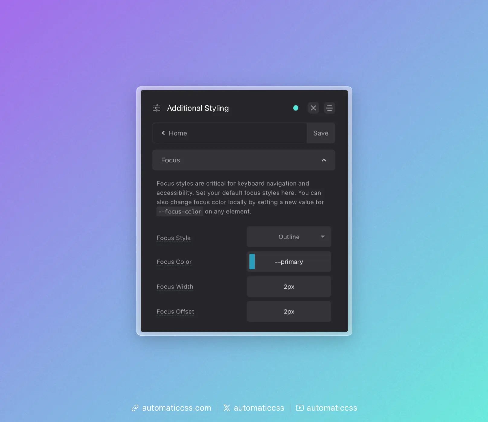

Focus styling is when an element's style is changed on [focus](https://developer.mozilla.org/en-US/docs/Web/CSS/:focus) (when the user interacts with the element via keyboard, click, etc.). It's a vital accessibility feature so users know which particular clickable element they're interacting with.

Websites don't have focus styling by default – the developer must add it. Or, in this case, a tool like Automatic.css adds it for you (yet another thing you don't have to remember!).

## Global Focus Styling

Navigate to Additional Styling > Focus.



Your options for controlling global/default focus styling are:

### Focus Style

Choose between Outline or Shadow. Outline uses the CSS [outline](https://developer.mozilla.org/en-US/docs/Web/CSS/outline) property. Shadow uses the [Box Shadow](https://developer.mozilla.org/en-US/docs/Web/CSS/box-shadow) property.

The advantage of `outline` is the ability to offset the focus ring from the element in focus. The advantage of the `box-shadow` method is that the box shadow will follow curves of elements being focused (where `outline` will put a square around rounded elements in many browsers).

### Focus Color

You can choose any color for your focus color. The default is your website's primary color.

### Focus Width

This setting allows you to control the thickness of the focus indicator. Rem units are a good choice here.

### Focus Offset

This setting is only available when the outline focus style is chosen. It allows you to control the amount of offset – the gap between the focus indicator and the element being focused.

## Changing Focus Color Locally

The default focus color is not always appropriate. For example, if your focus color and background color are the same, focus can't be seen. This creates an accessibility problem.

Since all focus styling uses the local variable `--focus-color`, you can simply assign a new value to `--focus-color` on any element to change the focus color for that element and its children.

For example, to change the focus color for all elements inside a dark section:

```CSS
.dark-section {
    --focus-color: var(--white);
}
```

This approach gives you complete control over focus colors anywhere on your site.

## Focus Parent

When using the [clickable-parent](clickable-parent.md) technique, you can also optionally set focus on the parent using the `?focus-parent` recipe or `@include focus-parent` mixin. This moves focus from the child link element to the parent element for better visual effect and accessibility accuracy.

You can learn more about this feature by reading the [Focus Parent documentation](focus-parent.md).

## Changes From 3.x

In ACSS 4.0:

- The `.focus--{color}` utility classes (such as `.focus--primary`, `.focus--secondary`, etc.) have been removed to reduce stylesheet bloat
- To change focus color locally, set `--focus-color` directly on the element or parent container (e.g., `--focus-color: var(--white);`)
- The dashboard panel has been renamed from "Accessibility" to "Focus" under Additional Styling
