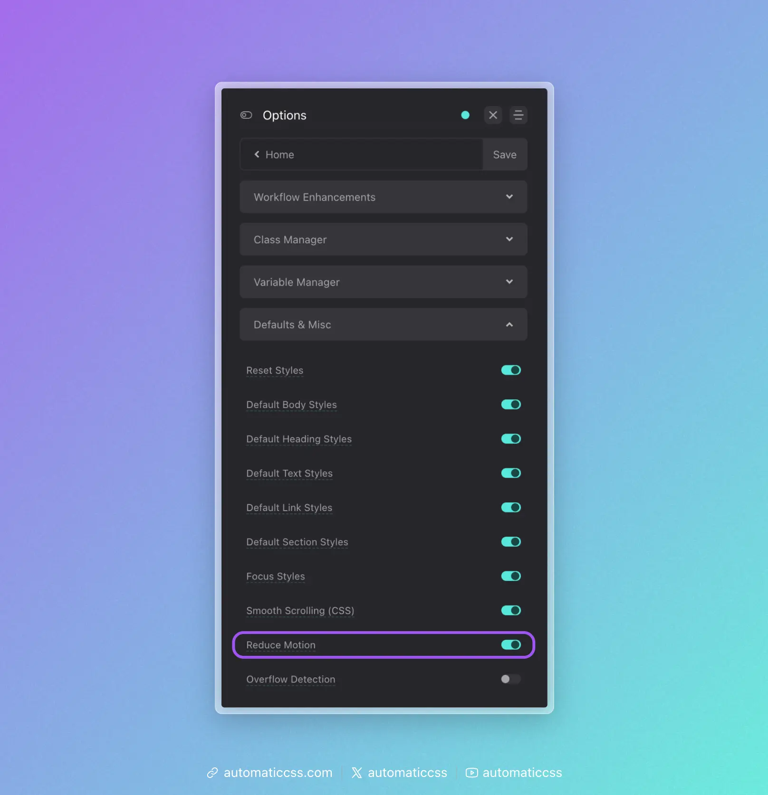

`prefers-reduced-motion` is an accessibility preference that all websites should aim to respect. If a user doesn't want to see motion, you should reduce or eliminate all animations.

ACSS allows you to remove animations with the flip of a switch by navigating to Options > Defaults & Misc > Reduce Motion.

**Note:** This setting is on by default and should not be turned off. Turning this setting off will technically make your site inaccessible.

Keep in mind that prefers-reduced-motion is not a browser setting, but an operating system setting. If your own operating system is set to prefers-reduced-motion, you will not see your own animations on your site.

This is not a bug. If you personally prefer reduced motion, you should consider why you're adding animations to websites for others. If you're doing it at the request of a client, you should switch your own OS preference until you're done working. Turning off the setting is inadvisable because it will make the site inaccessible to users who prefer reduced motion.

## Changes From 3.x

In ACSS 4.0, the Reduce Motion setting has moved from Options > Accessibility to Options > Defaults & Misc.
