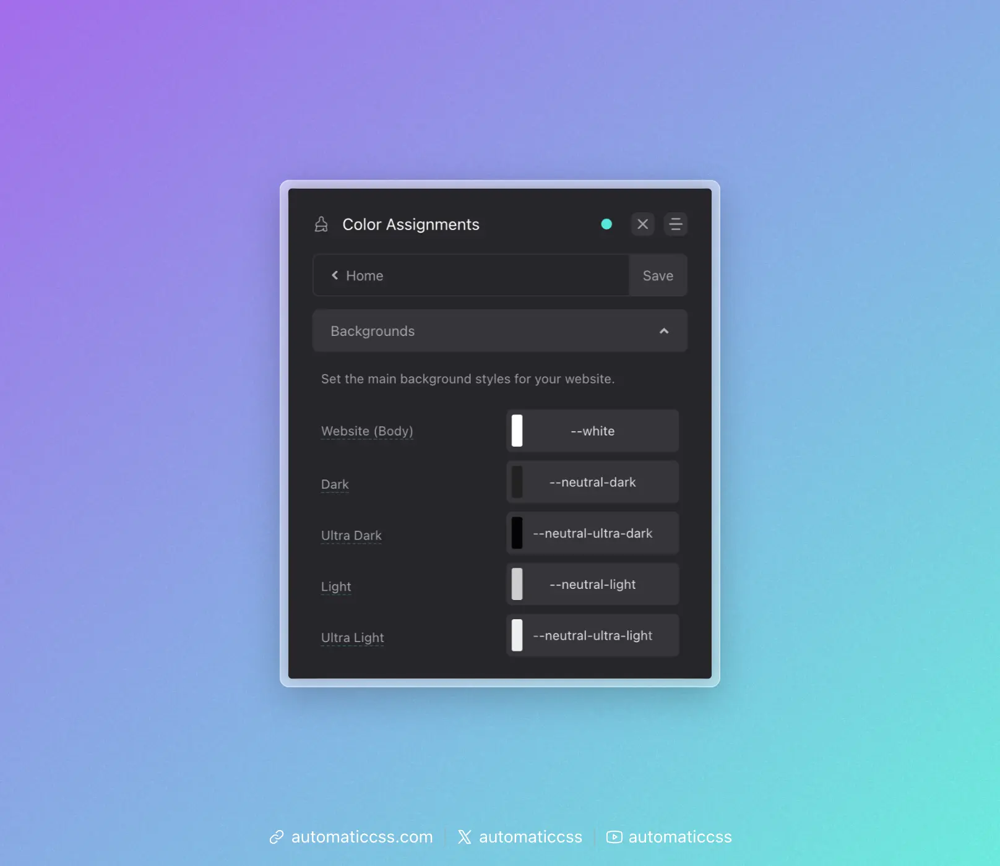

ACSS provides contextual background classes that not only set background colors but can also automatically adjust foreground elements (text, headings, links, buttons, icons) based on the background's lightness or darkness.

## The Value of Color Abstraction

When building websites, it's common to have repeating design patterns: alternating light and dark sections, card backgrounds, highlighted areas, and so on. Rather than hard-coding specific colors throughout your project, ACSS provides an abstraction layer through contextual background classes.

Instead of manually setting `background-color: var(--primary)` on every dark section, you use `.bg--dark`. The actual color that `.bg--dark` represents is defined in the Color Assignments panel of the dashboard. This separation between *usage* and *definition* is what makes the system powerful.

This approach offers several benefits:

- **Maintainability** - Change the color assignment once in the dashboard, and every `.bg--dark` section updates automatically
- **Consistency** - Common design patterns (alternating light/dark sections, card backgrounds, etc.) use consistent, predictable classes
- **Flexibility** - Easily experiment with different color schemes without touching your markup
- **Semantic meaning** - Classes describe the *intent* (dark, light) rather than a specific color, making your code more readable

## Contextual Background Classes

ACSS provides contextual background classes that represent abstract concepts rather than specific colors:

- `.bg--light` - A light background (uses `--bg-light` color)
- `.bg--ultra-light` - An ultra-light background (uses `--bg-ultra-light` color)
- `.bg--dark` - A dark background (uses `--bg-dark` color)
- `.bg--ultra-dark` - An ultra-dark background (uses `--bg-ultra-dark` color)

## Configuring Background Colors

Navigate to Color Assignments > Backgrounds to configure the colors used by contextual background classes.

- **Website (Body)** - The default background color for your site
- **Dark** - The color used by `.bg--dark`
- **Ultra Dark** - The color used by `.bg--ultra-dark`
- **Light** - The color used by `.bg--light`
- **Ultra Light** - The color used by `.bg--ultra-light`

## Automatic Color Relationships

When enabled, ACSS automatically adjusts foreground colors when you use contextual background classes. This ensures text remains readable regardless of background color.

For example, when you apply `.bg--dark` to a section, ACSS can automatically:
- Change heading colors to light
- Change text colors to light
- Change link colors appropriately
- Adjust button styles
- Adjust icon colors
- Adjust focus indicator colors

### Configuring Color Relationships

Navigate to Color Assignments > Light Relationships or Dark Relationships to configure which colors are applied automatically.

For each relationship type (Ultra Light, Light, Ultra Dark, Dark), you can configure:

- **Heading Color** - The color applied to headings
- **Text Color** - The color applied to body text
- **Link Color** - The color applied to links
- **Link Hover Color** - The color applied to links on hover
- **Button Background** - The background color for buttons
- **Icon Color** - The color applied to icons
- **Focus Color** - The color used for focus indicators

### Enabling/Disabling Color Relationships

The automatic color relationship feature can be toggled on or off in Options > Defaults & Misc.

## Using with Surfaces

[Surfaces](surfaces.md) can also participate in the automatic color relationship system. When you create a surface and assign it a color relationship (light, dark, ultra-light, or ultra-dark), it will automatically trigger the same foreground color adjustments as the corresponding `.bg--` class.

This means you can create complex background patterns or textures that still benefit from automatic text color adjustments.

## Changes From 3.x

In ACSS 4.0:

- Background classes and color relationships remain largely unchanged
- Surfaces now integrate with the color relationship system
- Dashboard location remains at Color Assignments > Backgrounds
