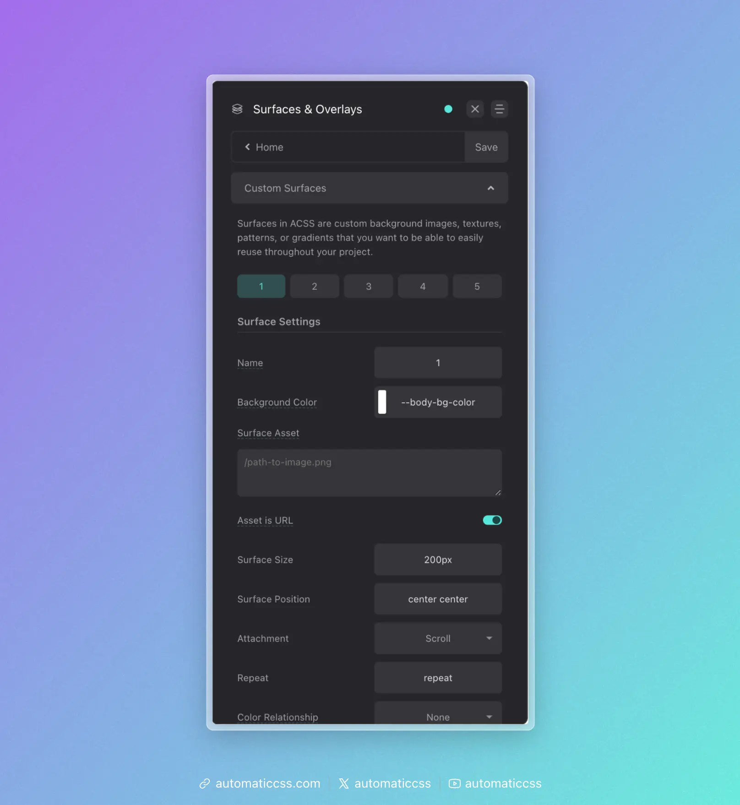

Surfaces in ACSS are reusable background styles that can include images, textures, patterns, or gradients. They provide a powerful way to create consistent, maintainable background designs across your project.

## What Are Surfaces?

A surface is a pre-configured background style that you can apply to any element using a utility class. Unlike simple background colors, surfaces can include:

- Background images or textures
- CSS gradients
- CSS patterns
- Background positioning and sizing
- Animation
- Overlay effects
- Automatic color relationship integration

## Creating Surfaces

Navigate to Surfaces & Overlays > Custom Surfaces to create up to 5 custom surfaces.



### Surface Options

Each surface has the following configuration options:

#### Main Settings

- **Name** - Give your surface a descriptive name. This creates a utility class `.surface-{name}` (e.g., `.surface-hero`, `.surface-card`). If left as the default number, the class will be `.surface-1`, `.surface-2`, etc.
- **Background Color** - A fallback color that displays if your asset has transparency or fails to load.
- **Surface Asset** - The main visual element of your surface. This can be:
  - A URL to an image: `/path/to/image.png`
  - A CSS gradient: `linear-gradient(to right, var(--primary), var(--secondary))`
  - A CSS pattern or any valid `background-image` value
- **Asset is URL** - Toggle this on if your asset is an image URL (adds the `url()` wrapper automatically).
- **Surface Size** - Controls `background-size` (e.g., `cover`, `contain`, `200px`).
- **Surface Position** - Controls `background-position` (e.g., `center center`, `top left`).
- **Attachment** - Controls `background-attachment` (`scroll`, `fixed`, `local`).
- **Repeat** - Controls `background-repeat` (e.g., `repeat`, `no-repeat`, `repeat-x`).
- **Color Relationship** - Links the surface to the automatic color relationship system.

#### Color Relationship

The Color Relationship option is powerful. When you select a relationship (ultra-light, light, ultra-dark, or dark), the surface will automatically trigger the same foreground color adjustments as `.bg--light`, `.bg--dark`, etc.

For example, if you create a dark textured surface and set its Color Relationship to "dark," any text, headings, links, and icons inside that surface will automatically switch to light colors.

#### Animation Options

If your surface supports animation (like a moving gradient or animated pattern), you can add CSS animation here:

- **Animation** - Any valid CSS animation shorthand (e.g., `gradientMove 10s infinite linear`).

Note: You must define the `@keyframes` for your animation in custom CSS.

#### Overlay Options

Each surface can have an optional overlay:

- **Enable Overlay** - Toggle overlay visibility
- **Overlay Color** - The overlay color
- **Overlay Opacity** - Control overlay transparency

## Using Surfaces

Apply a surface to any element using the generated utility class:

```html
<section class="surface-hero">
  <!-- Content here -->
</section>
```

Or use the CSS variable approach:

```css
.my-element {
  background: var(--surface-1);
}
```

## Surfaces vs Background Classes

| Feature | `.bg--{color}` | `.surface-{name}` |
|---------|----------------|-------------------|
| Solid colors | Yes | Yes (as fallback) |
| Images/textures | No | Yes |
| Gradients | Yes | Yes |
| Patterns | No | Yes |
| Animation | No | Yes |
| Built-in overlay | No | Yes |
| Color relationships | Yes | Yes |

Use background classes for simple solid color backgrounds. Use surfaces when you need more complex background designs that you want to reuse.

## Changes From 3.x

Surfaces are a new feature in ACSS 4.0. They provide a centralized way to manage complex, reusable background styles with full integration into the automatic color relationship system.
