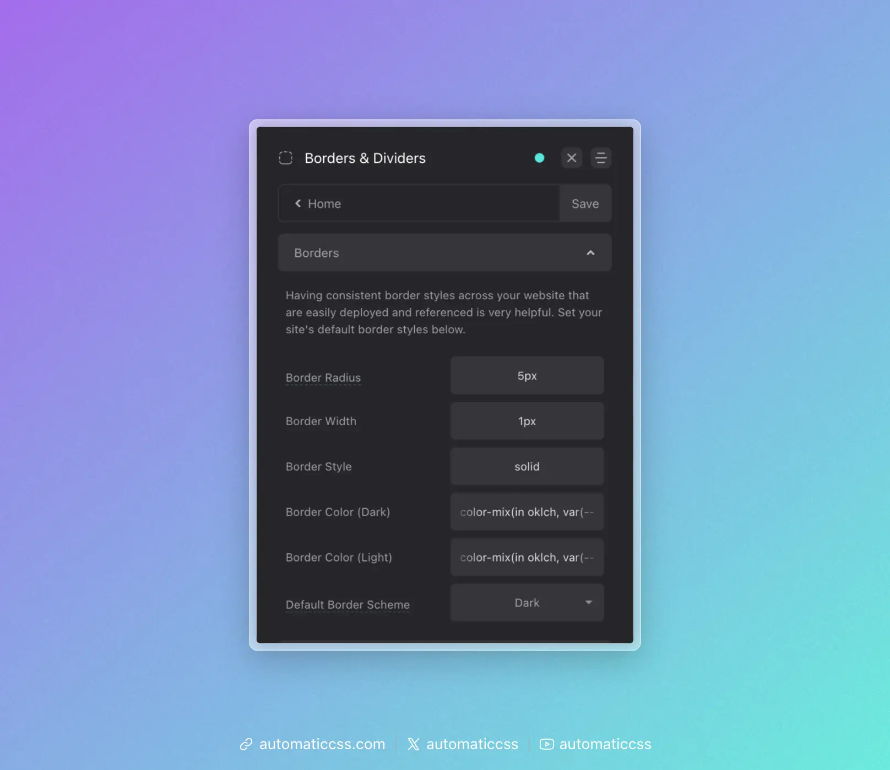

Borders in web design are elements of design that tend to be consistent throughout an entire website. For this reason, ACSS features a global border system to establish:

- Global Border Radius
- Global Border Width
- Global Border Style
- Global Border Color (Light Version)
- Global Border Color (Dark Version)
- Global Border Styling

Let's take a look at how all this comes together and gets used throughout your website.



## Global Border Radius

**What you need to know:** Use `var(--radius)` whenever you need to create border radius.

It's uncommon to use different radius values throughout a website (with one exception). Therefore, we should have a single radius token that stores our primary radius value.

ACSS uses `var(--radius)` for this.

The exception is with a concept called [concentric radius](https://www.30secondsofcode.org/css/s/nested-border-radius/). Unfortunately, concentric radius values can't be mapped to a single variable since they're heavily dependent on context and knowing the values of local elements.

For this reason, ACSS provides [recipes](../recipes/) for creating concentric radii (e.g., `?concentric-radius`).

**Note:** If your website's design does not use border radius anywhere, set this global value to "0."

## Auto Radius

You can automatically add your site's default radius to elements programmatically by turning on the "Add Radius Automatically" switch and targeting specific CSS selectors.


By default, we add radius to `img` (image) and `figure` elements that don't contain images. You can add any other selectors here that you'd like. Just make sure to wrap each selector in quotes and comma-separate them.

## Global Border Styling

**What you need to know:** Use `var(--border)` whenever you need to add a border.

Aside from border radius, creating a global border style involves three properties:

- **Border Width** via `var(--border-size)`
- **Border Style** via `var(--border-style)`
- **Border Color** via `var(--border-color-light)` or `var(--border-color-dark)`

ACSS allows you to set all three of these from the dashboard with color having both light and dark variations.

These properties combine together in a global variable called `var(--border)`. This allows you to add your global border style to any element like this:

```css
.card {
    border: var(--border);
}
```

The global border style is either light by default or dark by default, depending on what you choose in the dashboard. If you need the alternate version, you can simply call it with its own variable, like this:

```css
.card {
    border: var(--border-light);
}
```

If you need to customize the border for a specific instance, use the granular tokens directly. You can also remap token values locally:

```css
.card {
    --border-width: 5px;
    border: var(--border-width) var(--border-style) var(--border-color-dark);
}
```

This keeps the style and color connected to the global system while overriding the width locally.

## Global Border Style + Global Radius

Keep in mind that border-radius is not part of the shorthand border property, so it's not included in `var(--border)`. In order to get an element to have both the global radius and your global border style, you need to declare both, like this:

```css
.card {
    border: var(--border);
    border-radius: var(--radius);
}
```

## Changes From 3.x

In ACSS 4.0:

- Border utility classes (`.border`, `.border-dark`, `.border-light`, etc.) have been removed. Use `var(--border)` and the granular tokens instead.
- Border colors now use `color-mix()` for more modern, flexible color blending (e.g., `color-mix(in oklch, var(--black) 20%, transparent)`).
