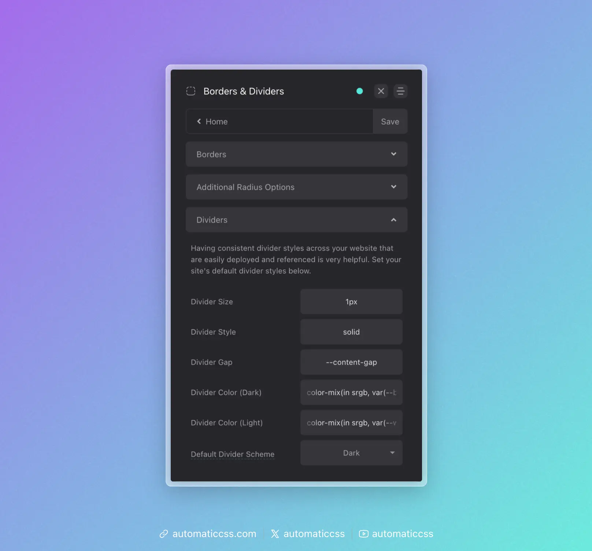

Dividers in web design are elements of design that tend to be consistent throughout an entire website. For this reason, ACSS features a global divider system to establish:

- Global Divider Inline Size
- Global Divider Size
- Global Divider Style (Literal)
- Global Divider Color (Light Version)
- Global Divider Color (Dark Version)
- Global Divider Gap
- Global Divider Style (Combined)

Let's take a look at how all this comes together and gets used throughout your website.



## Global Divider Style

**What you need to know:** Use `var(--divider)` whenever you need to reference your global divider style.

It's uncommon to use different divider styles throughout a website. Therefore, we should have a single divider token that stores our primary divider style.

ACSS uses `var(--divider)` for this, a token that is designed to be used with the CSS `border` property, like this:

```css
.accent-heading {
    border-block-end: var(--divider);
}
```

The color of your divider is dependent on whether you used the light or dark divider color in the dashboard for your primary style, but you can always call the alternate version by using the color specific tokens:

```css
.accent-heading {
    border-block-end: var(--divider-dark);
}
```

Of course, that applies the divider style, but creating the effect of a divider requires spacing between elements. This spacing is mapped to `var(--divider-gap)`. You can use this token however you see fit as there are many ways to achieve the spacing required for dividers.

In some cases, you might want to use a pseudo element without the use of the border property. In these cases, you can use the divider tokens by themselves, like this:

```css
.heading::after {
    content: '';
    position: absolute;
    inline-size: var(--divider-inline-size);
    height: var(--divider-size);
    background-color: var(--divider-color-dark);
}
```

Just note: If you don't use the border property, you won't be able to apply `var(--divider-style)` to achieve border style variations like dashed, dotted, etc.

## Divider Recipes

ACSS provides [recipes](../recipes/divider-recipes.md) for quickly applying dividers:

- `?divider-top` - Applies your global divider style to the top of an element, along with your desired gap
- `?divider-bottom` - Applies your global divider style to the bottom of an element, along with your desired gap
- `?divider-all` - A programmatic recipe that applies dividers and even gaps between all direct children of a parent element

The `?divider-all` technique uses programmatic margin rather than gap to ensure the technique works in block-level elements. For this reason, if your parent container is using flexbox/grid and gap, you should set gap to "0" to ensure that spacing is consistent.

## Altering Divider Instances

Whether you're using variables or recipes, you can re-map values on unique divider instances by redefining the value of the tokens locally.

For example, let's say you use `?divider-bottom` to add a bottom divider to an element. But, for this one particular instance, you want to set a custom color. To do this, simply redefine the value of `var(--divider)`. Just make sure you're using other divider tokens where possible to keep various styles hooked into the global divider system.

```css
#unique-element {
    --divider: var(--divider-size) var(--divider-style) var(--accent);
}
```

In the above example, `var(--accent)` is a custom color being used in place of the normal divider color. By using `var(--divider-size)` and `var(--divider-style)`, you're able to keep those aspects of the divider hooked into the global divider system.

## Changes From 3.x

In ACSS 4.0:

- Divider utility classes (`.divider-top`, `.divider-bottom`, `.divider--all`) have been removed. Use [divider recipes](../recipes/divider-recipes.md) instead (`?divider-top`, `?divider-bottom`, `?divider-all`).
- Divider colors now use `color-mix()` for more modern, flexible color blending.
