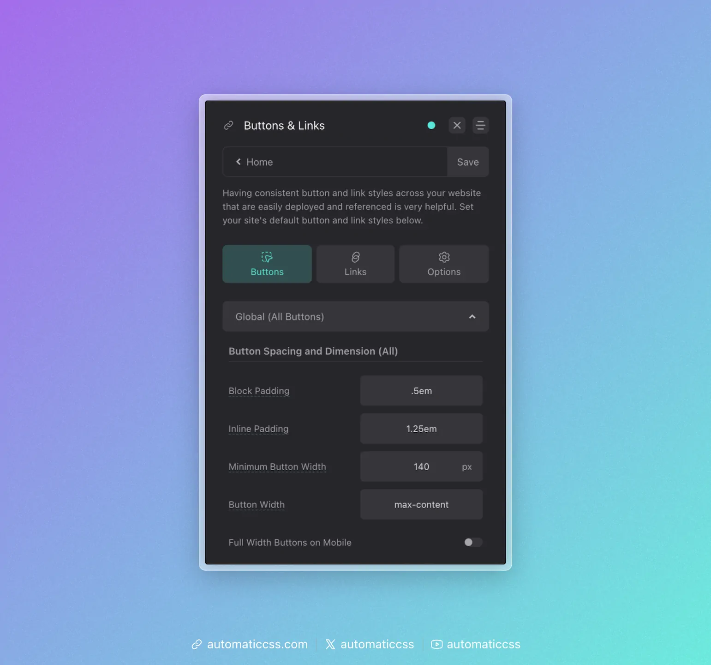
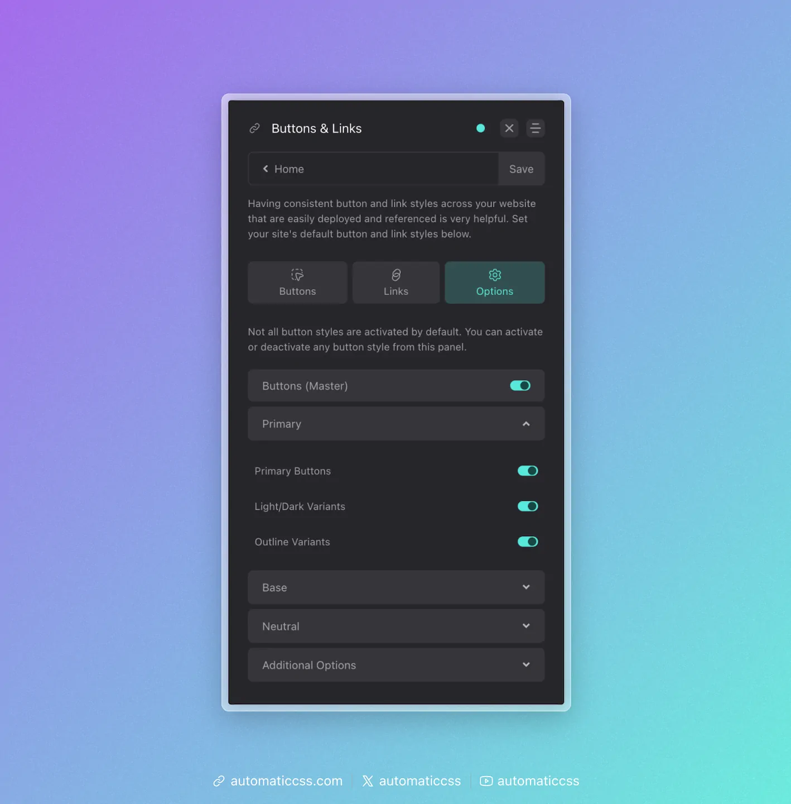
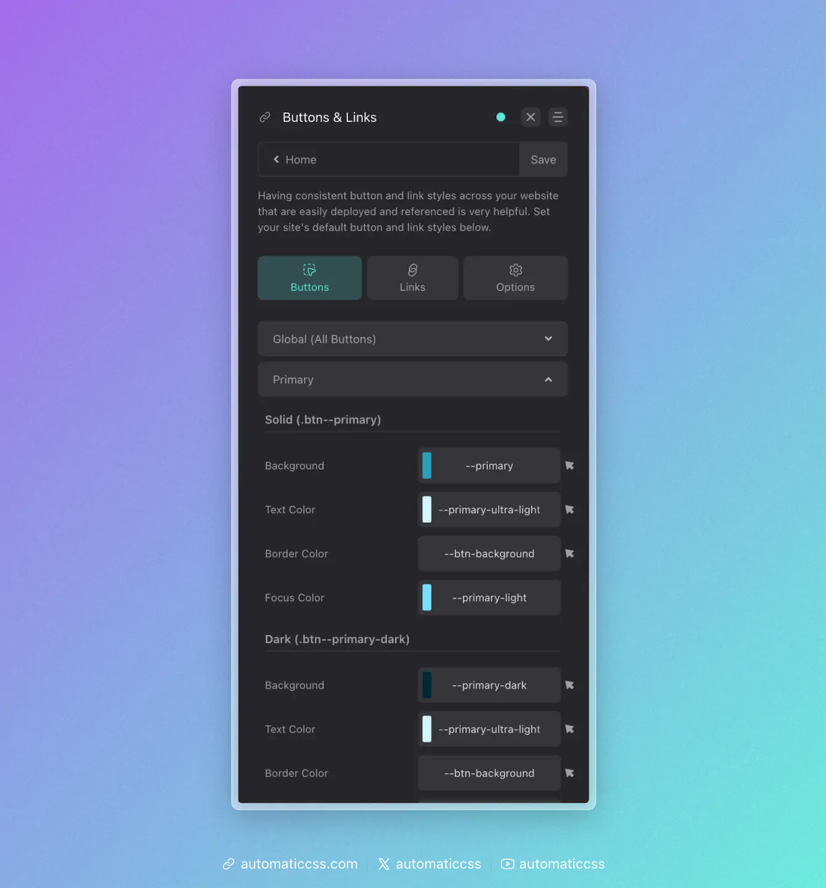

Buttons are used on nearly every page of a website, so it's important to set default styles for them. This is easy to do in the ACSS dashboard. Just navigate to the "Buttons & Links" tab.

## Default Button Styling



Default button styles apply to ALL buttons, regardless of color.

Sharing styles across button types ensures that all your buttons will be visually consistent concerning these default characteristics.

### Main Button Styling

- **Button Padding:** Set the top/bottom padding (Y) and left/right padding (X) for buttons. "Em" is the preferred unit here as it will cause the padding to scale up or down according to your button text size.
- **Minimum Button Width:** Sets a minimum width for all buttons. While buttons can still get wider according to their text, they'll never be narrower than this value. Do not set this value too high; it can cause horizontal scroll/overflow issues on mobile devices.

### Button Text Styling

- **Line Height:** Changes the line height of text on buttons. "1" is the widely accepted standard.
- **Letter Spacing:** Changes the letter spacing of button text.
- **Font Weight:** Changes the font-weight of all button text.
- **Font Family:** Changes the font-family of all button text.
- **Font Style:** Changes the font style of all button text.
- **Text Transform:** Changes the transform value of all button text.
- **Text Decoration:** Changes the text decoration of all button text.
- **Text Decoration on Hover**: Changes the text decoration of all button text on hover.
- **Custom Button Text Size:** Turn this on and then set a min/max value if you want the default button text to be something other than the "M" text size.

### Button Border Styling

- **Button Border Width:** Set the border width of your buttons. This applies to both solid and outline buttons.
- **Button Border Style:** Set the border style (solid, dashed, etc.).
- **Button Radius:** Set the border radius for all buttons. By default, buttons use your [website's global border-radius](../borders-dividers/global-border-system.md).

### Button Transition Styling

- **Use Global Transition (Default)**: Use your website's [global transition style](../effects/transition.md) for buttons.
- **Transition**: If you opt out of using the website's global transition style you can set a manual transition style.

**Radius Note:** Using `.rounded` classes or radius variables on your buttons are not advisable because this reduces global control. It's best to set your button radius here in the ACSS dashboard so that all your buttons inherit this default radius and no additional classes or variables are necessary.

## Available Buttons

Button styles in both solid and outline variants are available for all _active_ colors in ACSS:

1. Primary (with Light and Dark variants)
2. Secondary (with Light and Dark variants)
3. Tertiary (with Light and Dark variants)
4. Accent (with Light and Dark variants)
5. Base (with Light and Dark variants)
6. Neutral (with Light and Dark variants)

It should be noted that button styling will not load for colors that are turned off in the Palette area, nor will you see options for them in the dashboard.

You can also deactivate any button group you don't intend to use, even if you use that color group for other things. This will reduce the size of the framework.

To deactivate button styles, navigate to "Options" in the buttons panel and then choose the style you want to modify. You can choose whether or not to load solid, outline, and light/dark variants.



## Overriding the Style of Certain Buttons

Each button group has its own customization area in the ACSS dashboard.



This allows you to adjust the following for each button style:

- Background color
- Background color on hover
- Text color
- Text color on hover
- Border color
- Border color on hover
- Focus color

We recommend always using color variables to maintain consistency within the system and to maintain compatibility with color scheme features.

## Overriding Buttons in Specific Contexts

ACSS buttons use locally scoped variables (tokens), making them easy to override. You can override an individual button on a page, buttons in a specific section, or buttons across an entire page without affecting other buttons of the same type.

To override a button or group of buttons, use a selector to identify them and then redefine the value of its tokens.

For example, let's say you wanted to override the padding, font weight, background color, and hover background color of a single button:

```css
#btn123 {
    --btn-padding-block: 2em;
    --btn-padding-inline: 4em;
    --btn-font-weight: 900;
    --btn-background: var(--primary-dark);
    --btn-background-hover: var(--primary-ultra-dark);
}
```

Want to make this change across an entire page? You can add a body class (a class on the body element) to the page to affect all primary buttons:

```css
body.custom .btn--primary {
    --btn-padding-block: 2em;
    --btn-padding-inline: 4em;
    --btn-font-weight: 900;
    --btn-background: var(--primary-dark);
    --btn-background-hover: var(--primary-ultra-dark);
}
```

Now you've changed the style of all buttons on a page without affecting any other page of the site.

### Available Button Variables

Please reference our [button variables documentation](button-variables.md) for a full list of available button variables.

## Removing Color Relationships on Buttons

When buttons are placed on backgrounds that use automatic color relationships, the button colors may change automatically. If you want to prevent this, add the `.unrelate` class to the button element.

## Creating Custom Buttons

ACSS is designed to cover the basics regarding buttons, which will work for most websites. Create a custom button class if your design requires a super fancy button.

By using ACSS button class syntax (`.btn--`) all global styles will automatically apply to your new custom button.

All you have to do at that point is define values for each styling variable for that new button. You should do this on your new button class with custom CSS. It's easiest to use a [button recipe](../recipes/button-recipes.md) for this.

## Changes From 3.x

In ACSS 4.0:

- Deprecated button styles (action, white, black, shade) have been removed.
- Outline button border width is now unified with solid button border width for consistent sizing.
- Added font-family control for buttons.
- Added `.unrelate` class for removing color relationships on buttons.
