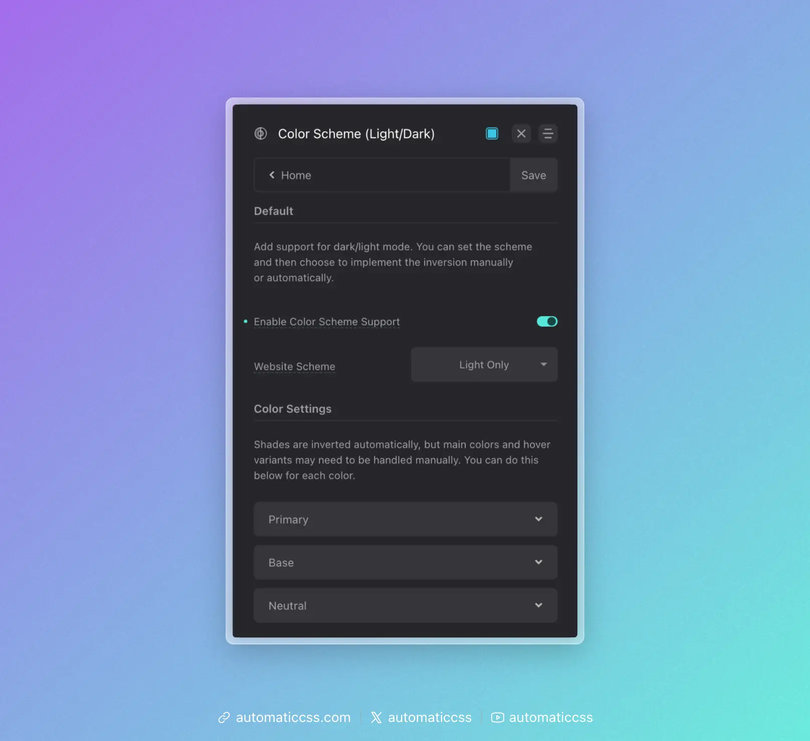
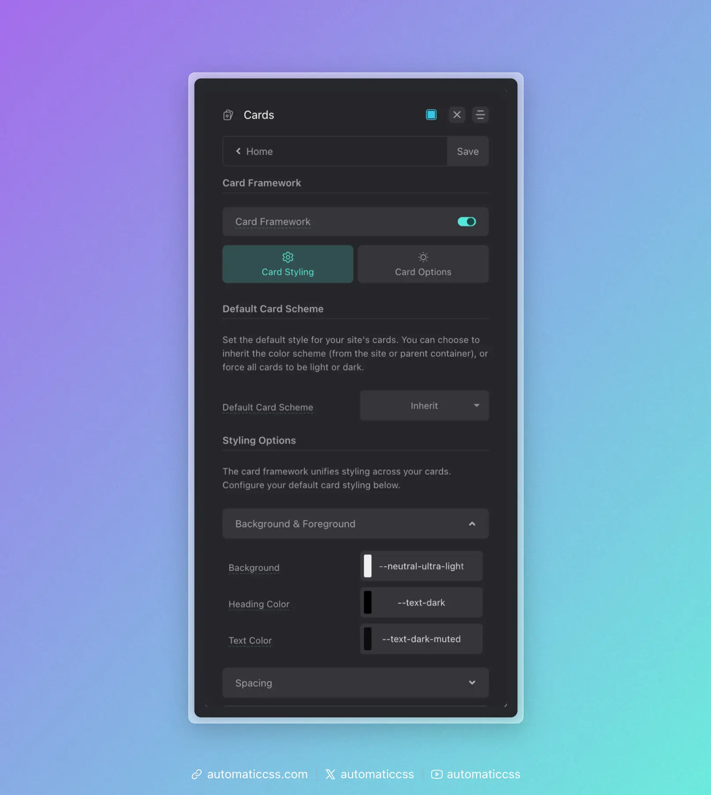

The Card Framework uses the CSS `color-scheme` property to manage light and dark card variants. This provides a clean, standards-based approach to card theming that integrates with browser and OS preferences.

**Prerequisite:** Color Scheme Support must be enabled in **Colors > Color Scheme** for these features to work.



## Default Card Scheme

Set the default color scheme for all cards in **Cards > Card Styling > Default Card Scheme**:



- **Inherit** – Cards inherit the color scheme from the site or parent container
- **Light** – Force all cards to use light styling
- **Dark** – Force all cards to use dark styling

## Per-Card Overrides

Individual cards can override the default scheme by adding a modifier to their class name:

```html
<!-- Force this card to be dark regardless of default -->
<div class="service-card--dark">
    ...
</div>

<!-- Force this card to be light regardless of default -->
<div class="testimonial-card--light">
    ...
</div>
```

The framework detects `--light` or `--dark` in the class name and applies the appropriate `color-scheme` value.

## How Color Scheme Works

The `color-scheme` CSS property tells the browser which color schemes an element supports. When set to `light` or `dark`, form controls, scrollbars, and other browser-rendered UI elements adapt accordingly.

More importantly, it provides a semantic signal that can be used with CSS to style content appropriately:

```css
.my-card {
    /* Light scheme styles apply by default */
    background: var(--white);
    color: var(--text-dark);
}

@media (prefers-color-scheme: dark) {
    .my-card {
        /* Dark scheme styles when user prefers dark */
        background: var(--neutral-dark);
        color: var(--text-light);
    }
}
```

## Styling Light vs Dark Cards

The Card Framework automatically adjusts colors based on the color scheme. Configure your defaults in the Card Styling panel:

### Background & Foreground

- **Background** – The card background color
- **Heading Color** – Color for headings inside cards
- **Text Color** – Default text color inside cards

These values should work well with both light and dark schemes, or you can use color variables that respond to color scheme changes.

## Integration With Site Color Scheme

When Default Card Scheme is set to "Inherit," cards will follow the color scheme of their parent container or the site. This is useful for:

- Sites with a global dark/light mode toggle
- Cards placed in sections with different background colors
- Respecting user OS preferences via `prefers-color-scheme`

## Changes From 3.x

In ACSS 4.0:

- Card variants now use the `color-scheme` CSS property instead of separate light/dark class systems
- Added "Inherit" option for Default Card Scheme to follow parent/site color scheme
