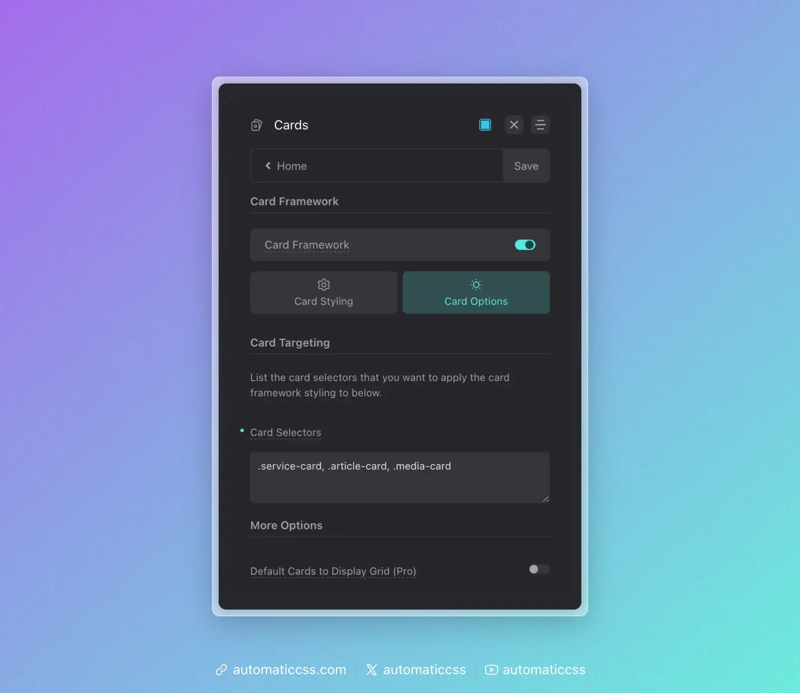

For maximum consistency on your projects, follow this recommended workflow when working with the Card Framework.

## 1. Enable the Card Framework Early

Turn on the Card Framework at the start of your project, before building any cards. This ensures every card benefits from the framework from day one.

## 2. Target Your First Card and Configure Defaults

First, add your card selector to the Card Selectors input. You need to target the card before you'll see the framework styles applied as you work.



Then, as you build the card, configure your default card styles in the dashboard:

- Card padding and gap
- Heading and text sizes
- Border radius and styling
- Media aspect ratios
- Icon and avatar sizes

These become the foundation for all cards on the site.

## 3. Use Consistent BEM Naming

The Card Framework recognizes certain naming patterns:

- `__media` – Featured images, videos, or media containers
- `__avatar` – Profile photos, headshots
- `[data-icon]` – Icons (must use data attribute)
- Standard heading elements (h1-h6)

Use these conventions consistently across all your cards.

## 4. Add New Cards to Targeting Immediately

As you create additional card types, add them to the Card Selectors input right away. Don't style cards manually and "plan to add them later."

## 5. Override With Tokens, Not Hard Values

When you need to customize a specific card, override using the framework tokens:

```css
.pricing-card {
    --card-padding: var(--space-l);
    --card-heading-size: var(--h2);
}
```

This keeps your customizations connected to the system. If global values change, your overrides still make sense relative to those changes.

## 6. Reserve Manual Styling for Unique Properties

Only write manual CSS for properties that are truly unique to a specific card—like a decorative border on pricing cards or a custom hover effect on portfolio cards. Let the framework handle the fundamentals.

## The Compound Effect

The real power of the Card Framework becomes apparent over time. On a site with 10+ card types, you might have:

- 50+ instances of padding declarations eliminated
- 50+ instances of border-radius declarations eliminated
- Dozens of gap, font-size, and color declarations consolidated

All of this controlled from a single dashboard panel. This isn't just about convenience—it's about building websites that remain consistent and maintainable as they grow.

The Card Framework transforms cards from a maintenance liability into a scalable, systematic component of your design system.
