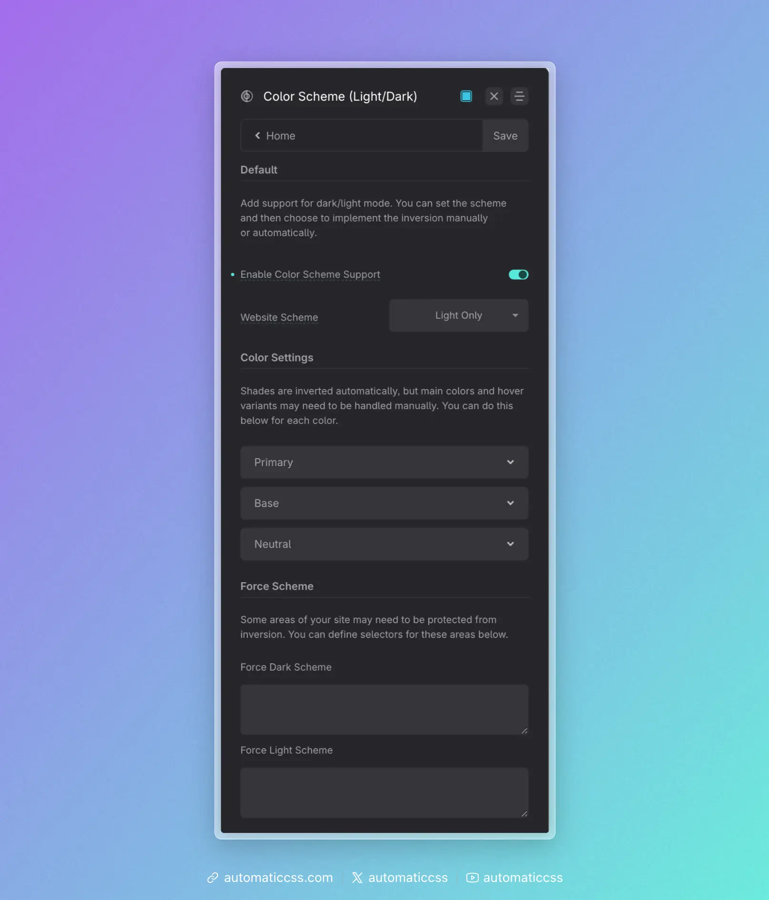
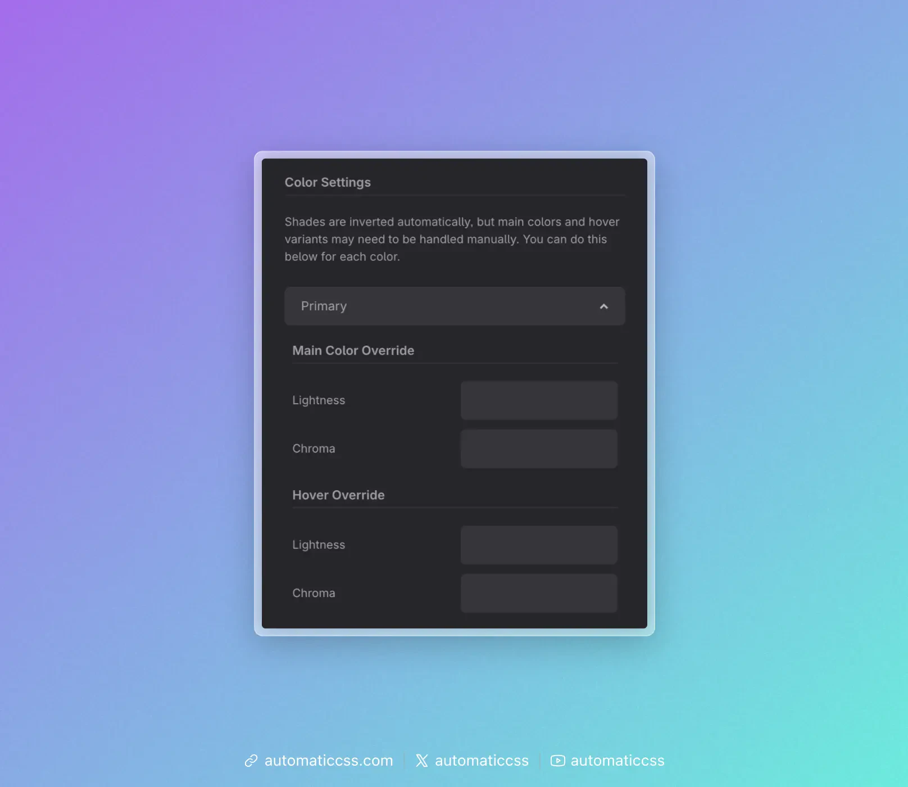
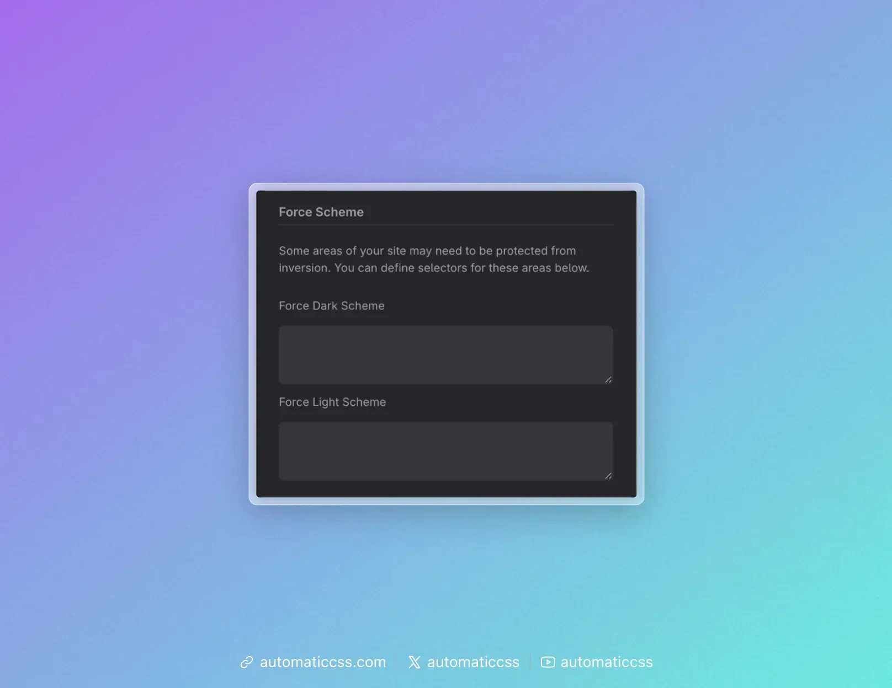

Color scheme (light/dark) support is configured in the ACSS dashboard under **Color Scheme (Light/Dark)**. When you enable it, ACSS converts your palette to use `light-dark()` and sets `color-scheme` so the browser and your variables stay in sync.

## Enable Color Scheme Support

Turn **Enable Color Scheme Support** on to:

1. **Convert all colors and shades** – Every palette variable is output as `light-dark(light-value, dark-value)` instead of a single value. So `var(--primary)`, `var(--base-dark)`, etc. automatically resolve to the right color for the current scheme.
2. **Auto shade inversion** – For each color, the **shades** (ultra-light, light, semi-light, semi-dark, dark, ultra-dark) are paired for light/dark: in dark mode, “ultra-light” shows the ultra-dark value, “ultra-dark” shows the ultra-light value, and so on. You don’t define dark-mode shades manually; they’re derived by inverting the light-mode scale.
3. **Enable color scheme utilities** – The `.scheme--light` and `.scheme--dark` classes (and any force-selectors you set) become meaningful, so you can force a scheme on specific areas.

With support **off**, palette variables are single values (no `light-dark`) and the site effectively has one scheme.

## Website Scheme

**Website Scheme** sets the default `color-scheme` on `:root`. It answers: “What scheme is the site mainly in, and does it support both?”

- **light only** – `color-scheme: light`. The site is light; dark mode is not used.
- **dark only** – `color-scheme: dark`. The site is dark; light mode is not used.
- **light dark** – `color-scheme: light dark`. The site supports both; the browser typically follows user preference (e.g. system or app setting) to choose.
- **normal** – Lets the browser decide without declaring a preference (less common).

Set this to match how you design and whether you want the site to follow the user’s light/dark preference.

## Main and hover overrides (Color Settings)

Shades are **inverted automatically** (e.g. light ↔ dark). The **main** (base) color and **hover** shade for each palette color are not auto-inverted by default—they use the same value in both schemes unless you override.

If you want a different main or hover color in dark mode (e.g. a slightly different primary for contrast or brand), use **Color Settings** (the per-color accordions that appear when Color Scheme Support is on). For each color (Primary, Secondary, Base, etc.) you get:

- **Main Color Override** – Lightness and Chroma for the *dark* side of `light-dark(main, alt)`. Leave blank to keep the same as light; set values to manually choose the dark-mode main color.
- **Hover Override** – Same idea for the hover shade in dark mode.

So you can either **rely on auto inversion only** (no overrides) or **tweak main/hover per color** for dark mode. Overrides are optional.

## Force Scheme

Some parts of the page may need to stay light on a dark site (or dark on a light site)—e.g. a quote card or an embed. Under **Force Scheme** you can set:

- **Force Dark Scheme** – A list of CSS selectors. Those elements get `color-scheme: dark`, so they and their descendants use the dark value of every `light-dark()` variable.
- **Force Light Scheme** – Same idea for `color-scheme: light`.

Alternatively, add the utility class **`.scheme--dark`** or **`.scheme--light`** to a wrapper so that subtree is forced to that scheme without configuring selectors in the dashboard.

## Summary

| Setting | Effect |
|--------|--------|
| **Enable Color Scheme Support** | Converts palette to `light-dark()`, auto-inverts shades, enables scheme utilities. |
| **Website Scheme** | Sets default `color-scheme` on `:root` (light only, dark only, light dark, or normal). |
| **Color Settings (per color)** | Optional main/hover overrides for dark mode (lightness/chroma). |
| **Force Scheme** | Optional selectors (or use `.scheme--light` / `.scheme--dark`) to force a scheme on specific areas. |

For the underlying CSS (e.g. how `color-scheme` and `light-dark()` work), see [Modern Color Scheme Workflow](modern-color-scheme-workflow.md). For how to apply these settings in practice (user preference, manual switch, or component-level scheme), see [Implementing Color Scheme](implementing-color-scheme.md).
