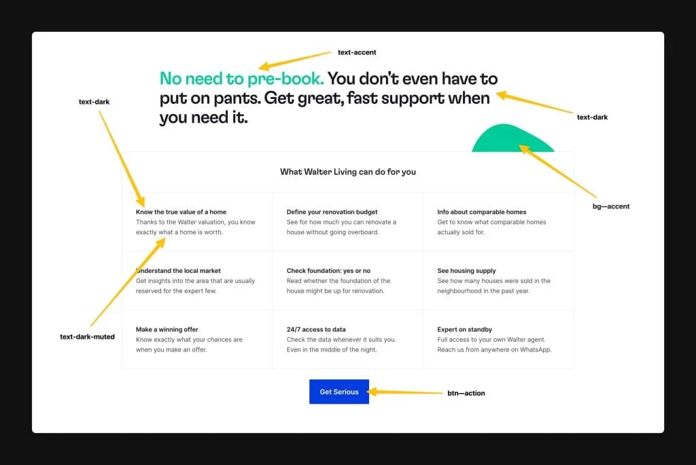

[ACSS 101.07.P2: Background & Text Color (Contextual Approach + Auto Color Relationships) - YouTube](https://www.youtube.com/watch?v=xhFOgOBV774&embeds_referring_euri=https%3A%2F%2Fautomaticcss.com%2F)

Once you setup your Palette in ACSS, you’ll want to set up Background and Text Assignments.

Rather than randomly using brand colors via color-related classes like [background color classes](../backgrounds/background-color-classes.md) or [text color classes](../typography/text-classes.md), Background & Text Assignments are a way to map specific colors to how they’re actually used on a website.

When you assign colors to specific contexts, you can build a site without referencing specific colors during the development process.

It’s easier to understand how this works if you look at a real example.

The light background of that section is the default body background color of the website, which ACSS outputs as `var(--body-bg-color)`, but could easily be referenced with `var(--bg-light)` or `var(--bg-ultra-light)`.

The vast majority of the text is dark text, so ACSS uses your dark text default color via `var(--body-color)`. However, some of the text is lower contrast (the paragraphs below the headings). We refer to lower-contrast text as “muted” text and we use `var(--text-dark-muted)` or `var(--text-light-muted)` to set these.

As you can see, we’re referencing the context of light backgrounds, dark text, muted text, etc. without the need for referencing specific colors. This is because the colors are pre-assigned to these contexts.

There are two main advantages to working this way:

1.  **Less thinking** – you can work within the context of “light and dark” without knowing or caring what color you need to use.
2.  **More theme-ability** – you can change the colors that are used on the site without ever replacing any classes or variables.

Once you setup assignments and start using them for the first time, you’ll get the hang of it and very quickly see the benefits.

## Setting Up Background Assignments

Open the dashboard and navigate to Backgrounds & Text. Choose the Backgrounds accordion:

ACSS Background Assignments

Start by telling ACSS what your default background color should be. By default, it’s var(–white), but you can use any color.

Next, assign your dark, ultra-dark, light, and ultra-light background options.

## Setting Up Text Assignments

Open the dashboard and navigate to Backgrounds & Text. Choose the Text accordion:

ACSS Text Assignments

Start by setting your website’s main text color. The default is `var(--text-dark)`. This is confusing to some users because `--text-dark` isn’t an actual color. But, stop and think about it for a moment.

If your website is light by default, then you’ll want dark text by default. There’s no reason to reference a specific color for this. You can just reference `var(--text-dark)` and then assign the necessary color to `var(--text-dark)`, which is the input immediately below. Sometimes I make `var(--text-dark-muted)` the default if I prefer to have muted text as my default text color. It’s up to you.

Point is, there’s no reason to reference an actual color in the “default” field — you can use one of the color assignment variables because those contain the desired color.

## Using Color Assignments in Your Workflow

Once your color assignments are setup, it’s important to make sure you use them properly in your workflow. This will ensure that you get all the efficiency and re-theming benefits from them.

For Backgrounds, you have four options (plus your default website background). The background options are:

- `.bg--light` and `--bg-light`
- `.bg--dark` and `--bg-dark`
- `.bg--ultra-light` and `--bg-ultra-light`
- `.bg--ultra-dark` and `--bg-ultra-dark`

It’s best to apply these with the utility classes, because they support [Automatic Color Relationships](automatic-color-relationships.md) (variables don’t).

Keep in mind that you also have your website’s default background color. Let’s say your default background color is `var(--white)`. By not using a background color on a section, it will default to white. So, now you have five simple options for setting background colors across your site.

For Text, you have four similar options. The text options are:

- `.text--light` and `--text-light`
- `.text--dark` and `--text-dark`
- `.text--light-muted` and `--text-light-muted`
- `.text--dark-muted` and `--text-dark-muted`

You can use either the utility classes or the variables here – both are compatible with Automatic Color Relationships.

Using these assignments everywhere they’re possible, dramatically improves efficiency, flexibility, scalability, maintainability, and theme-ability.
