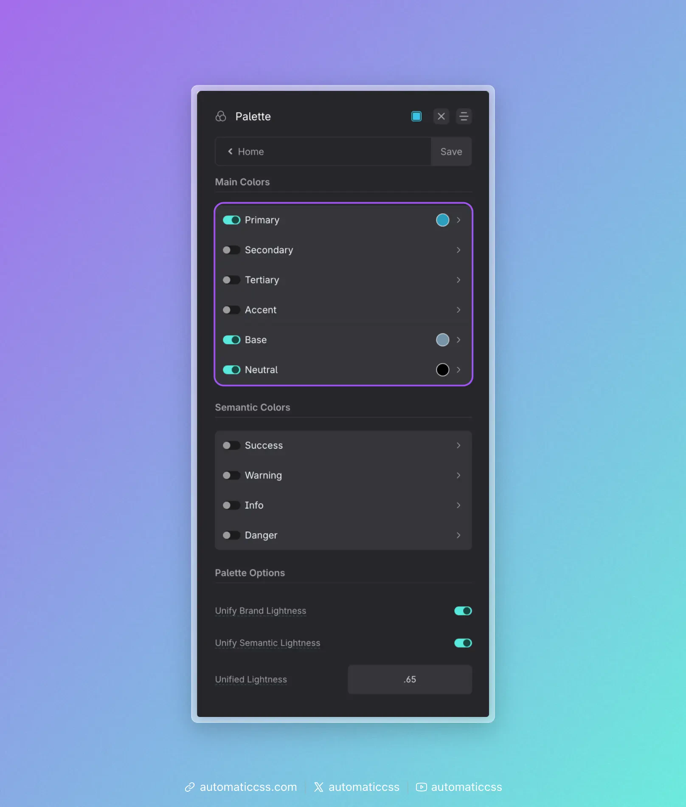

Main Colors are the six named slots in the ACSS palette: **Primary**, **Secondary**, **Tertiary**, **Accent**, **Base**, and **Neutral**. You configure them in the dashboard under **Palette > Main Colors** (enable only the ones you need). Each main color is expanded into a full scale of shades (ultra-light through ultra-dark, plus hover) that you can use via classes and variables.

## The six main colors

| Color      | Role in a typical project |
|-----------|----------------------------|
| **Primary**   | The main brand color—logos, key CTAs, links, and the main “action” color. Use it where you want the eye to go first. |
| **Secondary** | The second brand color. Use for less dominant buttons, highlights, or supporting elements so Primary stays the star. |
| **Tertiary**  | A third brand color. Use sparingly for variety (e.g. alternate sections, tags, or accents) without competing with Primary and Secondary. |
| **Accent**    | The least used brand color. Use for special emphasis, badges, or one-off moments so it stays noticeable when it appears. |
| **Base**      | The workhorse for backgrounds and body text. Often a dark shade for text on light UIs, or a light shade for light backgrounds. Drives default section and card backgrounds and readable text. |
| **Neutral**   | Greys from white to black. Use for borders, dividers, disabled states, subtle backgrounds, and any place you need “no hue” so brand colors stand out. |

You don’t have to enable all six. Many sites use **Primary**, **Base**, and **Neutral**; add **Secondary**, **Tertiary**, or **Accent** when the design calls for them.

## How to use them in a typical project

**Think in roles, not hex codes.** Decide “this is a primary action” or “this needs a neutral border,” then use the matching class or variable (e.g. `.btn--primary`, `var(--base-dark)`). If you rebrand later, you change the color once in the dashboard and the whole site updates.

**Reserve Primary for what matters.** Buttons that submit, main links, and key CTAs should use Primary (or a Primary shade). Use Secondary or Neutral for less important actions so Primary stays strong.

**Use Base for default UI.** Body text and default section backgrounds usually come from Base (or Neutral). That keeps the canvas consistent and leaves Primary/Secondary for emphasis.

**Use Neutral for structure.** Borders, dividers, and subtle grey backgrounds are good fits for Neutral. Avoid using a brand color for “just a line” or “just a grey box.”

**Keep Accent rare.** Use Accent for a few high-impact spots (e.g. “New” badges, one hero accent). If it’s everywhere, it stops feeling special.

Once your main colors are set, use [Color Assignments](../color-assignments/background-text-assignments.md) to map them to contexts (e.g. light/dark backgrounds, muted text) and [Automatic Color Relationships](../color-assignments/automatic-color-relationships.md) so foreground styles follow background classes. For transparencies, see [Transparencies](transparencies.md).
