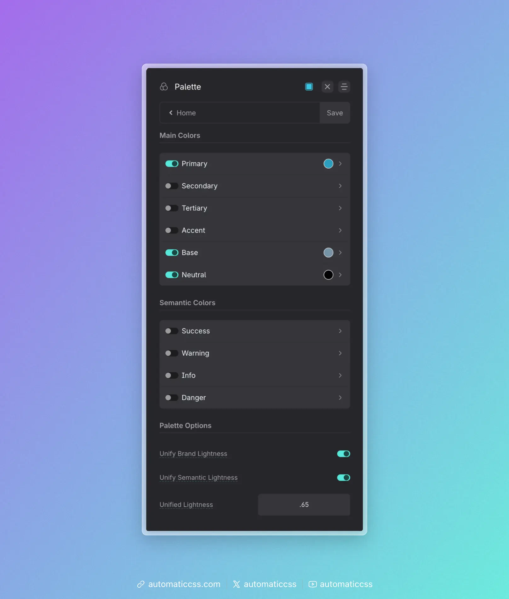

The ACSS Palette is your central place for color. Configure it in the dashboard under **Palette**.

The panel is organized into **Main Colors**, **Semantic Colors**, and **Palette Options** (Unified Lightness). Use the toggles to enable only the colors you need. From here you manage main brand colors, generated shades, semantic (status) colors, and how foreground and background colors work together.

## Why OKLCH?

ACSS builds your palette in **OKLCH** (Oklab Lightness, Chroma, Hue), a modern CSS color space. You still enter colors in the dashboard the way you always have (e.g. hex); ACSS converts and stores them in OKLCH under the hood.

**What is OKLCH?** It describes each color with three components: **Lightness** (how bright it is, 0–1), **Chroma** (color intensity/saturation), and **Hue** (the angle on the color wheel). Unlike older spaces like RGB or HSL, OKLCH is *perceptually uniform*: equal changes in the numbers produce equal changes in how we see the color. That makes it predictable when generating shades or blending.

**Why we chose it.** For design systems, that predictability is a big win. When ACSS creates your light/dark/ultra-dark shades, it adjusts lightness in OKLCH so each step *looks* like a consistent step to the eye. Mixing colors (e.g. with `color-mix()`) and supporting light/dark mode with `light-dark()` also behave more reliably in OKLCH. It’s well supported in modern browsers and aligns with the direction of CSS color (Level 4). So you get a more consistent, maintainable palette without having to think about the color space yourself.

## Named main colors

Instead of generic "color 1, color 2," ACSS uses **named roles**: Primary, Secondary, Tertiary, Accent, Base, and Neutral. Each name describes how that color is usually used (e.g. Primary = main brand and actions, Base = backgrounds and body text, Neutral = greys). That gives you a small set of decisions that map to how you actually design: you think "I need the primary color" or "I need a dark neutral," not "I need #3a7bd5." You only enable the slots you need (toggles in the dashboard), and you can re-theme a site by changing the color behind each name without hunting through hundreds of hex values. The same names and classes work across projects; only the actual colors change.

## Auto-generated shades (and customizing them)

For each main color you enable, ACSS **auto-generates a scale of shades**: ultra-light, light, semi-light, semi-dark, dark, ultra-dark, and a dedicated hover shade. That way you get a full light-to-dark range for buttons, backgrounds, text, and borders without defining every step yourself. The scale is built in OKLCH so the steps are perceptually even—each shade feels like a consistent step lighter or darker.

Every generated shade is **customizable**. In the dashboard, each main color has a row of shade swatches; you can leave the auto-generated values as-is or override any of them (e.g. to match brand guidelines or a designer's hex list). So you get a sensible default scale out of the box, but you stay in control. See [Main Colors](main-colors.md) for the six color roles and how to use them; the dashboard shows the shade swatches for each.

**In this section:**

- **[Main Colors](main-colors.md)** – The six main colors (Primary, Secondary, Tertiary, Accent, Base, Neutral), what they’re for, and how to use them in a typical project.
- **[Semantic Colors](semantic-colors.md)** – Warning, Info, Success, and Danger colors for alerts and status, with classes and variables.
- **[Unified Lightness](unified-lightness.md)** – Use a shared OKLCH lightness for brand and/or semantic base colors so the palette feels consistent.
- **[Transparencies](transparencies.md)** – Create transparencies on demand with `color-mix()` or Relative Color Syntax; no pre-built transparency tokens in 4.x.

After you set up your palette, use **[Color Assignments](../color-assignments/background-text-assignments.md)** to map colors to contexts (light/dark backgrounds, muted text, etc.) and to configure [Automatic Color Relationships](../color-assignments/automatic-color-relationships.md)—so contextual background classes like `.bg--ultra-dark` automatically set matching text, heading, link, and button styles.
