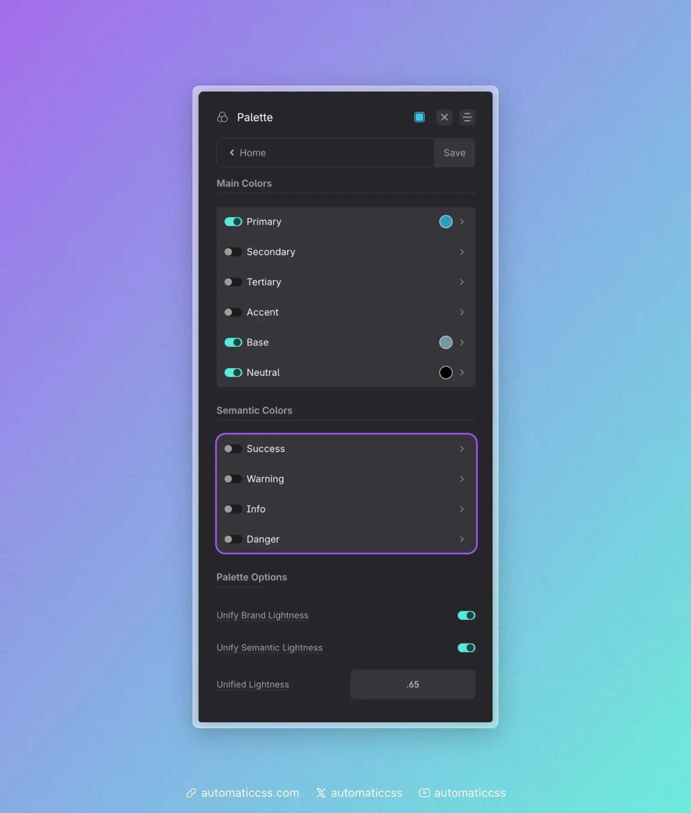

Aside from programmable brand colors, ACSS provides you with the following semantic colors:

- Warning (alert, caution)
- Info (general information)
- Success (safe, correct)
- Danger (error, wrong)

These follow the status color standard set by Bootstrap many years ago, providing colors that indicate a specific “notice” for the user and that \[typically\] have nothing to do with a website’s brand palette.

Note: Prior to v3.0, Semantic Colors were referred to as “contextual colors” This name was updated to “Semantic Colors” to eliminate confusion with the new Contextual Color System.

## Configuring Semantic Colors

Semantic colors are configured in the **Palette** area of the dashboard, under the **Semantic Colors** section.

## Semantic Color Classes

The following groups of classes have access to the semantic colors by default:

- `.text--`
- `.bg--`
- `.link--`

The class naming convention is the same as with all other colors in ACSS. Append `{color}` or `{color-shade}` to the above classes on the desired element (e.g. `.text--warning-light`)

## Status Color Variables

You can access status color variables and color partials along with classes. These variables allow you to reference status colors or parts of status colors when creating custom classes or within custom CSS.

The naming conventions for status colors are the same as all the other colors in the ACSS system: `var(--{name})` and `var(--{name}-{shade}`.

The following partials are available for each status color:

- `{color}-hex`
- `{color}-hsl`
- `{color}-h`
- `{color}-s`
- `{color}-l`
- `{color}-rgb`
- `{color}-r`
- `{color}-g`
- `{color}-b`

These partials remove all limitations from the status color system, allowing you to make custom shades, transparencies, hovers, and more.
