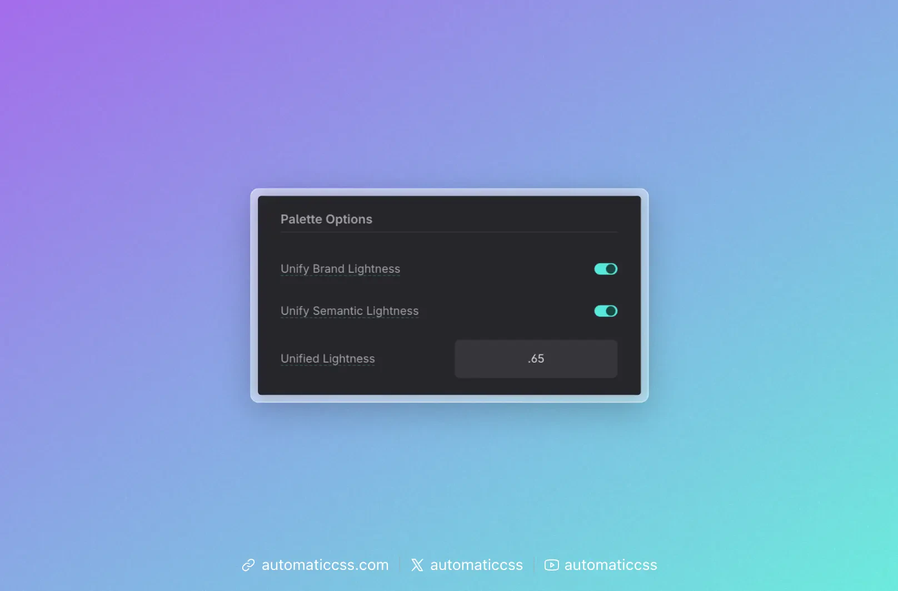

Unified Lightness lets you give all your main (brand) colors—and optionally your semantic colors—the same **OKLCH lightness** for their base swatch. That way Primary, Secondary, Tertiary, Accent, and Base don’t just share a system; they sit on the same “brightness” plane. The result is a palette that feels visually consistent: same perceived lightness, different hue and chroma.

Configure it under **Palette > Palette Options**.

## Settings

- **Unify Brand Lightness** – When on, the main (base) swatch of each **main color** (Primary, Secondary, Tertiary, Accent, Base) uses the Unified Lightness value for its OKLCH **L** channel. Hue and chroma stay from the color you set; only lightness is forced to the shared value. Shades (ultra-light, light, dark, etc.) keep their own lightness steps.
- **Unify Semantic Lightness** – When on, the base swatch of each **semantic color** (Success, Warning, Info, Danger) uses the same Unified Lightness value. Useful if you want status colors to match the perceived brightness of your brand colors.
- **Unified Lightness** – The shared lightness value (0–1). Default is **0.65** (65% in OKLCH). This field appears when at least one of the two toggles above is on. Lower = darker base swatch; higher = lighter.

## When to use it

**Keep it on (default)** when you want one consistent “weight” for all base brand and/or semantic colors—e.g. for buttons, badges, or icons that should feel like they’re from the same family. You can still use the full shade scale (light, dark, ultra-dark, etc.) for backgrounds and text; only the base swatch is unified.

**Turn it off** when you want each color to keep its natural lightness (e.g. a darker Base and a brighter Primary). You get more variety, but less of a “single lightness” look.

## Technical note

Unified Lightness only changes the **L** (lightness) of the base swatch in OKLCH. It does not change the generated shades (ultra-light through ultra-dark) or hover; those still use their own L values. So you get a unified “main” color across the palette while keeping the full shade scale for each.
