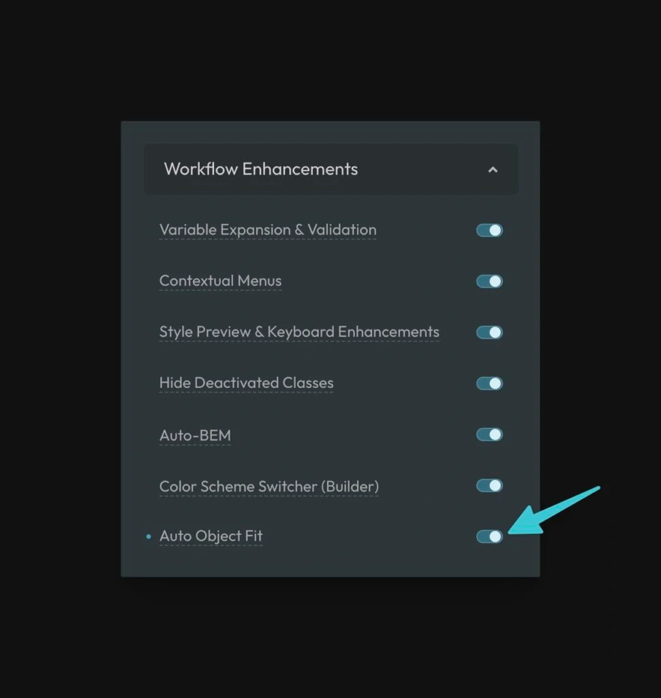

Auto Object Fit applies a default `object-fit` and `object-position` to all images so you can resize or constrain them (e.g. with an aspect ratio) without distortion and without adding classes or CSS each time.

Turn it on under **Options > Workflow Enhancements**: enable the **Auto Object Fit** toggle.



When enabled, ACSS sets every `img` to:

- `object-fit: var(--object-fit, cover);`
- `object-position: var(--object-position, 50% 50%);`

So the default is `cover` and centered, but you can override it anywhere by setting the CSS variables.

## Overriding per area

You can change the behavior for a section, template, or container by setting the variables on a parent:

```css
.this-specific-area {
  --object-fit: contain;
}
```

All images inside that area will use `contain` instead of `cover`. You can also set `--object-position` (e.g. `top left`, `50% 0`) for different crop focus.

## Changes From 3.x

In ACSS 4.0:

- Auto Object Fit is still under **Options > Workflow Enhancements**. Behavior is unchanged: all `img` elements get `object-fit: var(--object-fit, cover)` and `object-position: var(--object-position, 50% 50%)`, and you can override via the same variables.
