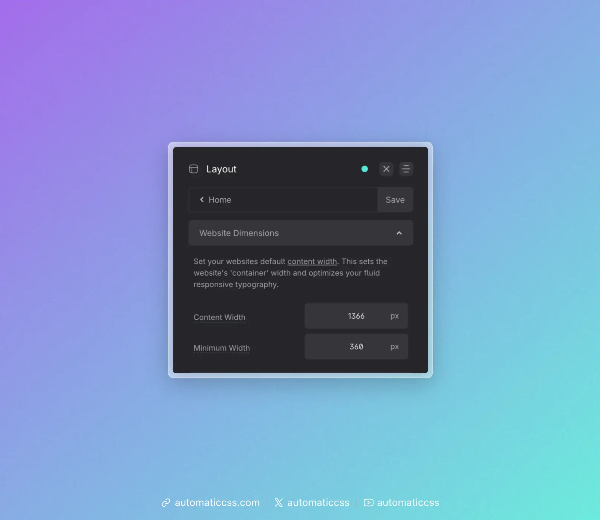

The content width of a website is defined as the width from the left edge of the content to the right edge of the content on a screen that’s large enough not to compress the content.


The content width of your website is an important value. You’ll commonly want to set elements to the website’s content width, or to a value that’s somehow relative to the website’s content width.

You can easily do this in Automatic.css with two utilities: `.content-width` and `var(--content-width)`.

## Setting Your Website’s Content Width

Your website’s content width is set in the ACSS dashboard under **Layout > Website Dimensions**.



**Content Width** is the width of your content on desktop devices and is the value referenced by the `.content-width` class and `var(--content-width)`. **Minimum Width** defines the narrowest viewport the framework uses for fluid calculations (e.g. responsive typography).

Once you’ve set your website’s content width, you need to inform your page builder of this value. The best way of doing this is with `var(--content-width)`. You don’t want to tell the page builder the same static value because this creates a potential disconnect should your content width ever change.

If you set your content width in ACSS and then reference that value everywhere else with variables, you’re free to make changes to this value without anything breaking.

## The Content Width Utility Class

Any time you need to set an element’s width to your website’s content width, you can use the `.content-width` class. This class sets the element’s `max-inline-size` (max-width) to `var(--content-width)` so the element stays responsive.

## The Content Width Variable

I already mentioned that you can use `var(--content-width)` in your page builder’s global theme styles, but you can do a lot more with this variable.

Any time you need a custom element (an element with a BEM class) to be content width, it’s best to use the variable instead of the utility class. Set the element’s `width` to 100% and then use the variable with the `max-width` property.

```css
.custom-element {
  width: 100%;
  max-width: var(--content-width);
}
```

Another everyday use is within calculations.

Let’s say I want an element to be 75% of the content width. I can easily do this:

```css
.my-element {
  width: 100%;
  max-width: calc(var(--content-width) * 0.75);
}
```

You might say, “why not just make the element 75% of the container?”

While that would work on desktop, it wouldn’t have the same effect on mobile. On mobile, it’ll always remain 75% wide, which is often undesirable. Using the content-width variable gets you 75% on desktop and 100% on mobile because the max-width variable is referencing a fixed value rather than a percentage.

In essence, the variable is automatically responsive while the percentage value causes complications on mobile devices.

## Changes From 3.x

In ACSS 4.0:

- Content width and minimum width are set under **Layout > Website Dimensions** (formerly in the Viewport tab).
- The `.content-width` class now sets `max-inline-size` (logical property) instead of `max-width`; behavior is unchanged.
- `var(--content-width-safe)` remains available for gutter-aware max width.
