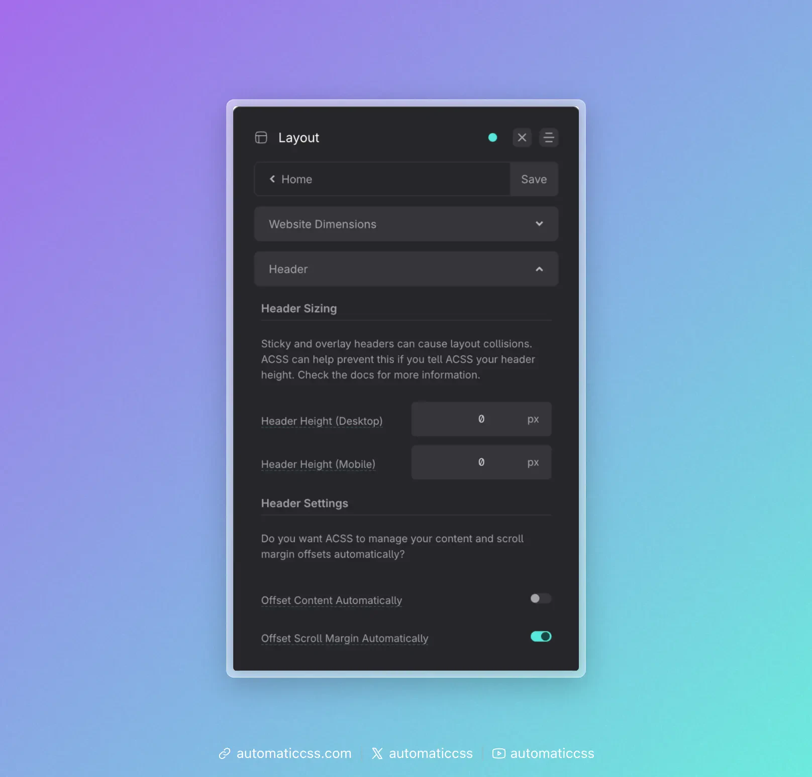
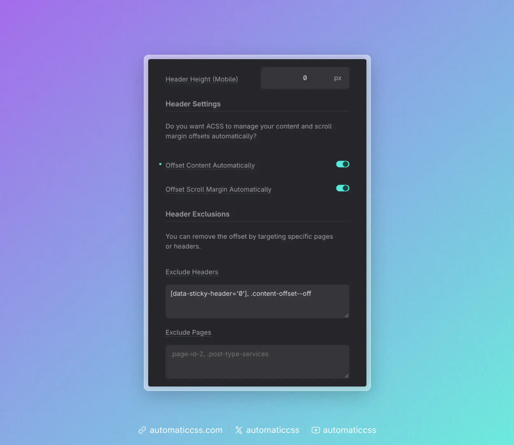

ACSS uses your header height to avoid layout collisions: sticky and overlay headers can cover content or cause uneven spacing. Once you tell ACSS your header height, it can set the `--header-height` variable and use it for content offsets, sticky offsets, and scroll margins.

Configure header height and related options under **Layout > Header**.

## Header Height Values

In **Layout > Header**, open the **Header Sizing** section. ACSS needs the height of your header at two breakpoints:

- **Header Height (Desktop)** – height of your header on desktop
- **Header Height (Mobile)** – height of your header on mobile

ACSS combines these into a fluid `--header-height` value that scales between the two. To get the values: load your site, right-click the header, and read the computed height at desktop and mobile widths. Enter those values (in px) into the inputs.

If your header height changes later, update these values and regenerate.

## Header Settings

Two toggles control how ACSS uses the header height:

### Offset Content Automatically

If you use a sticky or overlay header, the first section on each page can look cramped because the header takes vertical space. Turn **Offset Content Automatically** on so ACSS adds `margin-block-start: var(--header-height)` where needed, restoring balanced spacing for the first section. This only applies when header height values are set.

### Offset Scroll Margin Automatically

For in-page links (anchor / “scroll to hash”), the target can end up hidden behind the header. Turn **Offset Scroll Margin Automatically** on so ACSS uses your header height when setting scroll margins, keeping the target visible. See [Scroll Offsets](scroll-offsets.md) for details.

## Header Exclusions

When **Offset Content Automatically** is on, the **Header Exclusions** section appears.

### Exclude Headers

You can disable the content offset when certain headers are on the page. Enter one or more CSS selectors that match those headers (comma-separated). For example, use a data attribute so you can control stickiness from your CMS:

- Default: `[data-sticky-header='0'], .content-offset--off` – headers with `data-sticky-header="0"` or the `.content-offset--off` class do not trigger content offset.

### Exclude Pages

You can disable the offset on specific pages by entering body/page selectors (e.g. WordPress body classes like `.page-id-2` or `.post-type-services`), comma-separated.

## Sticky Offset

Sticky elements (e.g. with the `.sticky` class) normally stick to the top of the viewport; a sticky header can cover them. You can have ACSS offset them using your header height.

In **Additional Styling > Sticky**, turn on **Offset Sticky Automatically**. ACSS will then use `--header-height` (or your custom sticky offset) so sticky elements sit below the header. You can still override the offset per element with a custom `--sticky-offset` or `inset-block-start` value.

## Changes From 3.x

In ACSS 4.0:

- Header height is set in **Layout > Header** (under **Header Sizing**) as **Header Height (Desktop)** and **Header Height (Mobile)**; ACSS still outputs a fluid `--header-height`.
- **Offset Page Content Automatically** is renamed to **Offset Content Automatically** and remains in Layout > Header.
- **Offset Scroll Margin Automatically** is a new toggle in Layout > Header for scroll-to-hash behavior (replacing or clarifying prior scroll-offset behavior).
- **Header Exclusions** (Exclude Headers, Exclude Pages) appear when Offset Content Automatically is on; defaults include `[data-sticky-header='0']` and `.content-offset--off`.
- Sticky offset is still configured in **Additional Styling > Sticky** (“Offset Sticky Automatically”).
