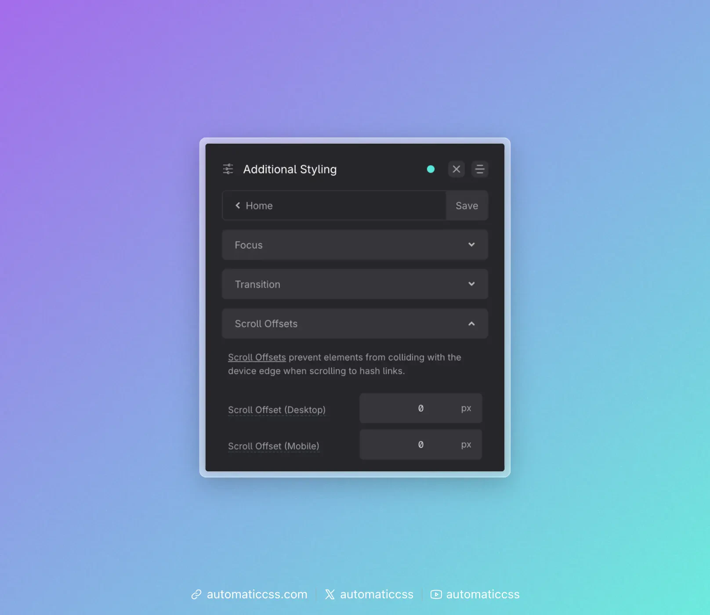

Scroll offsets prevent the target of a hash link from sitting flush against the top of the viewport (or under a sticky header) when users click “scroll to anchor.” ACSS lets you set a scroll margin so the target has breathing room.

Configure scroll offsets under **Additional Styling > Scroll Offsets**.

## Settings

- **Scroll Offset (Desktop)** – Extra margin (in px) applied when scrolling to hash links on desktop. Use this when you want more space above the target than the header alone provides.
- **Scroll Offset (Mobile)** – Same as desktop, for mobile viewports. You can set different values per breakpoint.

These values are added on top of any offset that comes from your header height (see below).

## Using header height for scroll margin

If you use a sticky header and have set [Header Height](header-height.md) in **Layout > Header**, you can turn on **Offset Scroll Margin Automatically** in that same panel. ACSS will then use your header height when computing the scroll margin, so the target of hash links appears below the header instead of under it. The Scroll Offset (Desktop) and Scroll Offset (Mobile) values in Additional Styling are added on top of that.

If you don’t use a sticky header, leave the scroll offset fields at 0 or set them to whatever extra spacing you want above hash targets.

## Changes From 3.x

In ACSS 4.0:

- Scroll offsets are configured under **Additional Styling > Scroll Offsets** (same location). The two fields are now labeled **Scroll Offset (Desktop)** and **Scroll Offset (Mobile)** (px).
- Whether the header height is used for scroll margin is controlled by **Offset Scroll Margin Automatically** in **Layout > Header** (see [Header Height](header-height.md)), not in the Scroll Offsets panel.
