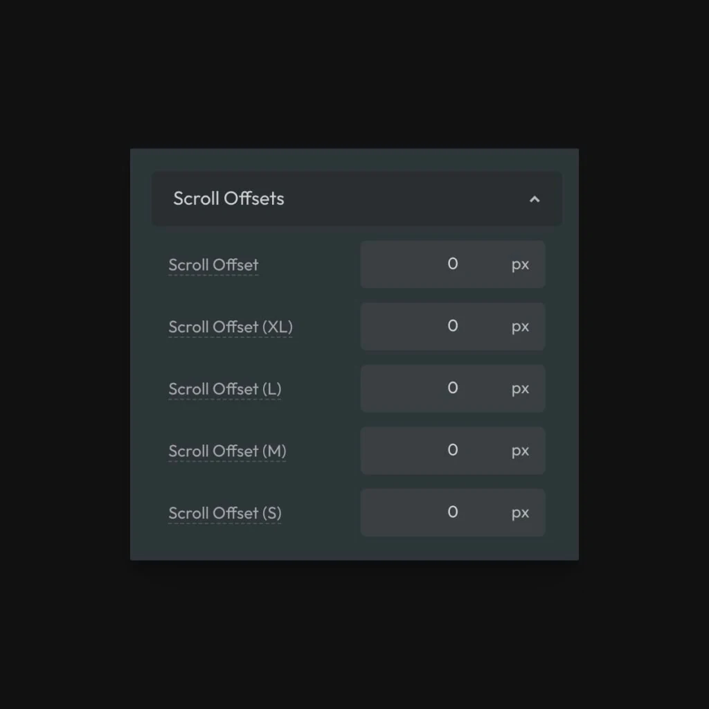

ACSS allows you to set offsets for scroll-to-hash links. This ensures that when users scroll to a hash link on your page, the content has some breathing room and isn’t touching the edge of the screen.

Scroll Offset Settings

Even worse, on some sites the sticky header covers up the content!

If you’re using a sticky header and have already set your header heights, Automatic.css will create an offset equal to the height of your header automatically. You don’t have to do anything else. If, however, you want to set an \*additional\* offset for extra breathing room, you can do that via the Scroll Offsets panel.

Again, you can set a different value at each breakpoint to dial in the exact result you’re going for.
