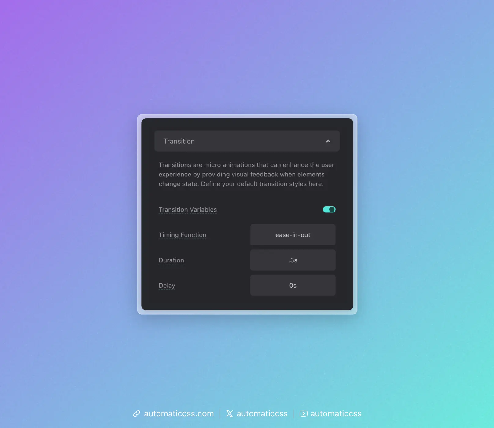

It's common for clickable and hoverable elements to have transition styling. It's also common for clickable and hoverable elements to share transition styling for consistency purposes.

Given this fact, ACSS offers global transition variables that you can use to maintain consistent transitions across your site.

For buttons and links, ACSS applies your global transition settings by default (override available).

For other elements, you'll need to apply the transition yourself.

## Using the Transition Variable

The primary way to use ACSS transitions is with the `var(--transition)` variable, which contains the duration, timing function, and delay values. You specify the property to transition, followed by the variable:

```css
.my-card {
    background-color: var(--bg-light);
    transition: background var(--transition);
}
```

For multiple properties, use comma-separated values:

```css
.my-card {
    background-color: var(--bg-light);
    color: var(--text-dark);
    transition: background var(--transition), color var(--transition);
}
```

## How the Transition Variables Work

The global transition style is set in the dashboard with three main properties:



- **Timing Function** – The easing curve for the transition (e.g., `ease-in-out`)
- **Duration** – How long the transition takes (e.g., `.3s`)
- **Delay** – Time before the transition starts (e.g., `0s`)

These inputs map to corresponding variables that you can use granularly:

- `var(--transition-duration)`
- `var(--transition-timing)`
- `var(--transition-delay)`

The combined `var(--transition)` variable contains all three values for convenience.

## Granular Control

If you need more control, you can use the individual variables:

```css
.my-card {
    transition: background var(--transition-duration) var(--transition-timing) var(--transition-delay);
}
```

Or mix global and custom values:

```css
.my-card {
    transition: background .7s ease .2s, color var(--transition-duration) var(--transition-timing);
}
```

## Overriding Transitions Locally

If you need to override transition values locally, you must use the granular variables rather than `var(--transition)`. The combined variable is pre-computed, so redefining individual variables won't affect it.

Use granular variables for local overrides:

```css
.my-card {
    transition: background var(--transition-duration) var(--transition-timing) var(--transition-delay);
}

.my-card.slow {
    --transition-duration: .6s;
    --transition-timing: ease-out;
}
```

Or use calc for relative adjustments:

```css
.slow-card {
    --transition-duration: calc(var(--transition-duration) * 2);
    transition: background var(--transition-duration) var(--transition-timing) var(--transition-delay);
}
```

## Removing Global Transition

If you don't want transitions on elements, you can disable the "Transition Variables" toggle in the dashboard.

## Changes From 3.x

In ACSS 4.0:

- The manual transition assembly input has been removed. Use `transition: property-name var(--transition);` syntax instead.
- The `.transition` utility class has been removed in favor of the variable-based approach.
