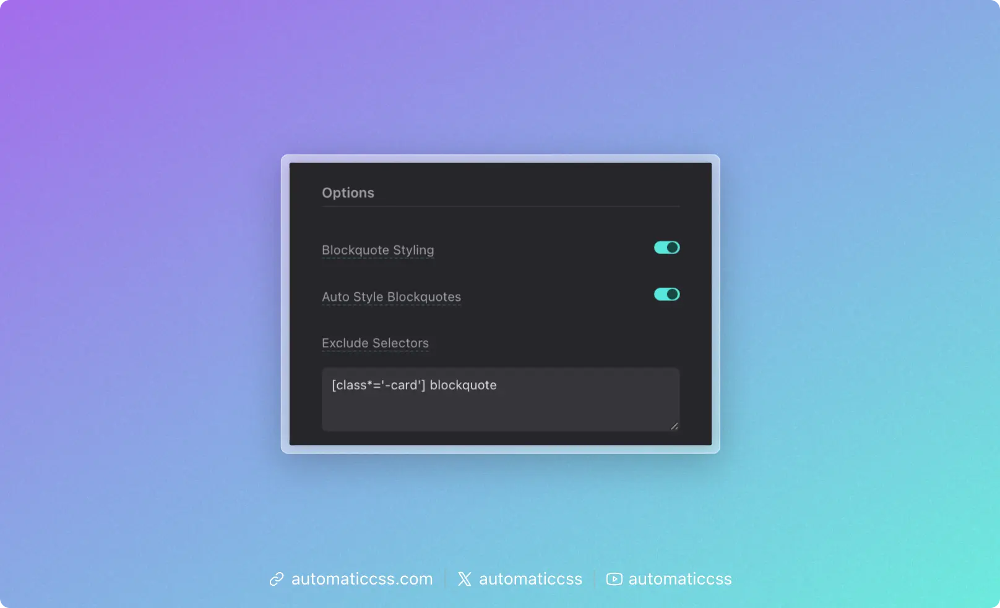

:::info Version
This feature was introduced in ACSS 4.0.
:::

Blockquotes are a common HTML element used to display quoted text, testimonials, or highlighted content. Automatic.css provides a comprehensive blockquote styling system that automatically styles your blockquote elements while giving you complete control over their appearance through the dashboard.

## What Are Blockquotes?

Blockquotes (`<blockquote>`) are semantic HTML elements designed to indicate that the enclosed text is a quotation from another source. They're commonly used for:

- Testimonials
- Pull quotes in articles
- Highlighted quotes from interviews
- Referenced content from other sources

Automatic.css automatically styles all blockquote elements on your site, making them visually distinct and professional without requiring any additional classes.

## Automatic Styling



By default, Automatic.css automatically styles all `<blockquote>` elements on your site. This means you can simply add a blockquote element to your content, and it will be styled according to your dashboard settings.

### Blockquote Styling Option

In the dashboard under **Additional Styling > Blockquotes > Options**, you'll find a "Blockquote Styling" toggle. This master switch controls whether blockquote styling is enabled at all. When this is enabled (default), blockquote variables and styles are loaded. When disabled, no blockquote styling will be applied and the CSS variables won't be generated, allowing you to completely disable the feature if you don't need it.

### Auto Style Option

In the dashboard under **Additional Styling > Blockquotes > Options**, you'll also find an "Auto Style Blockquotes" toggle. When this is enabled (default), all `<blockquote>` elements are automatically styled. When disabled, only elements with the `.blockquote` class will be styled.


This gives you flexibility: enable automatic styling for convenience, or disable it if you prefer to manually control which blockquotes get styled using the `.blockquote` class.

### Excluding Selectors

Sometimes you may want to exclude specific blockquotes from receiving automatic styling. This is useful when third-party plugins or themes use blockquotes that you don't want styled, or when you have custom blockquotes that need different styling.

In the dashboard under **Additional Styling > Blockquotes > Options**, you'll find an "Exclude Selectors" textarea. Enter a comma-separated list of selectors here, and those blockquotes will be excluded from automatic styling.

For example, if you want to exclude blockquotes with the class `.custom-quote` and blockquotes within a specific container, you would enter:

```
.custom-quote, .special-container blockquote
```

The excluded selectors are applied using the `:where(:not(:is(...)))` CSS selector pattern, ensuring they won't receive blockquote styling while maintaining proper specificity.

## Dashboard Configuration

All blockquote styling is controlled through the dashboard at **Additional Styling > Blockquotes**. The configuration starts with an Options section, followed by four styling sections:

### Main Blockquote Styling

The main section controls the structural and visual container properties of your blockquotes:

- **Padding**: The space around the blockquote content (default: `var(--space-m)`)
- **Gap**: The gap between blockquote content elements (default: `1em`)
- **Border Width**: The thickness of the border (default: `0 0 0 3px` - creates a left border)
- **Border Style**: The style of the border, such as `solid`, `dashed`, or `dotted` (default: `solid`)
- **Border Color**: The color of the border (default: `var(--primary)`)
- **Border Radius**: Rounded corners for the blockquote (default: `var(--radius)`)
- **Background**: Background color or gradient (default: `var(--neutral-ultra-light)`)
- **Box Shadow**: Shadow effect for the blockquote (default: `none`)
- **Max Width**: Maximum width constraint (default: empty, which means no limit)

### Text Styling

The text section controls typography and text appearance for content within blockquotes. These styles are applied to `<p>` elements inside the blockquote for better specificity and inheritance:

- **Color**: Text color (default: `inherit`)
- **Font Family**: Font family for the blockquote text (default: `inherit`)
- **Font Style**: Font style like `normal`, `italic`, or `oblique` (default: `normal`)
- **Font Size**: Size of the text (default: `var(--text-l)`)
- **Font Weight**: Weight of the text like `normal`, `bold`, `400`, or `700` (default: `normal`)
- **Line Height**: Spacing between lines (default: `inherit`)
- **Text Align**: Text alignment like `left`, `center`, `right`, or `justify` (default: `left`)
- **Text Transform**: Text transformation like `none`, `uppercase`, `lowercase`, or `capitalize` (default: `none`)

### Footer & Caption Styling

Blockquotes can include a `<footer>` element to display attribution or source information. The footer section controls styling for this element:

- **Padding**: Space around the footer content (default: `0`)
- **Margin**: The margin around the footer & caption content (default: `1em 0`)
- **Font Family**: Font family for the footer text (default: `inherit`)
- **Font Size**: Size of the footer text (default: `var(--text-s)`)
- **Font Weight**: Weight of the footer text (default: `normal`)
- **Font Style**: Style of the footer text (default: `normal`)
- **Line Height**: Spacing between lines in the footer (default: `1.5`)
- **Text Transform**: Text transformation for the footer (default: `none`)
- **Color**: Text color of the footer (default: `currentColor`)

### Cite Styling

Blockquotes often include a `<cite>` element to reference the source. The cite section controls styling for citation elements:

- **Font Size**: Size of the cite text (default: `inherit`)
- **Font Weight**: Weight of the cite text (default: `inherit`)
- **Font Style**: Style of the cite text (default: `inherit`)
- **Line Height**: Spacing between lines in the cite (default: `inherit`)
- **Text Transform**: Text transformation for the cite (default: `inherit`)
- **Color**: Text color of the cite (default: `currentColor`)

## CSS Variables

All blockquote styling is controlled through CSS custom properties (variables) that are automatically generated based on your dashboard settings. These variables follow a consistent naming pattern:

### Main Blockquote Variables

- `--blockquote-padding`
- `--blockquote-gap`
- `--blockquote-border-width`
- `--blockquote-border-style`
- `--blockquote-border-color`
- `--blockquote-border-radius`
- `--blockquote-background`
- `--blockquote-box-shadow`
- `--blockquote-max-inline-size`

### Text Variables

Text-related variables apply to `<p>` elements within blockquotes:

- `--blockquote-text-color`
- `--blockquote-text-font-family`
- `--blockquote-text-font-style`
- `--blockquote-text-font-size`
- `--blockquote-text-font-weight`
- `--blockquote-text-line-height`
- `--blockquote-text-align`
- `--blockquote-text-transform`

### Footer Variables

- `--blockquote-footer-padding`
- `--blockquote-footer-margin-block`
- `--blockquote-footer-font-family`
- `--blockquote-footer-font-size`
- `--blockquote-footer-font-weight`
- `--blockquote-footer-font-style`
- `--blockquote-footer-line-height`
- `--blockquote-footer-text-transform`
- `--blockquote-footer-color`

### Cite Variables

- `--blockquote-cite-font-size`
- `--blockquote-cite-font-weight`
- `--blockquote-cite-font-style`
- `--blockquote-cite-line-height`
- `--blockquote-cite-text-transform`
- `--blockquote-cite-color`

## Using Blockquotes

### Basic Usage

Simply add a `<blockquote>` element to your HTML. For text styling to apply correctly, wrap your content in `<p>` tags:

```html
<blockquote>
  <p>This is a blockquote. It will be automatically styled according to your dashboard settings.</p>
</blockquote>
```

### With Footer and Cite

For more complete blockquotes with attribution:

```html
<blockquote>
  <p>The only way to do great work is to love what you do.</p>
  <footer>
    — Steve Jobs, <cite>Stanford Commencement Address</cite>
  </footer>
</blockquote>
```

The `<p>` element will be styled according to your text settings, the `<footer>` element will be styled according to your footer settings, and the `<cite>` element will be styled according to your cite settings.

### With Figure and Figcaption

Blockquotes can also be wrapped in a `<figure>` element with a `<figcaption>` for attribution. This is a semantic HTML pattern that works well for quoted content:

```html
<figure>
  <blockquote cite="https://example.com/source">
    <p>The only thing we have to fear is fear itself.</p>
  </blockquote>
  <figcaption>— Franklin D. Roosevelt, <cite>First Inaugural Address</cite></figcaption>
</figure>
```

When using a `<figure>` element, the figure itself receives the main blockquote styling (padding, background, border, etc.) to ensure the `<figcaption>` is included within the styled container. The `<blockquote>` inside the figure does not receive the main styling (since it's a child of figure), but the `<p>` element inside the blockquote will still be styled according to your text settings. The `<figcaption>` will be styled according to your footer settings, and the `<cite>` element within the figcaption will be styled according to your cite settings.

### Manual Styling (When Auto Style is Off)

If you've disabled automatic styling, use the `.blockquote` class:

```html
<blockquote class="blockquote">
  <p>This blockquote will be styled because it has the .blockquote class.</p>
</blockquote>
```

When using the figure structure, place the `.blockquote` class on the `<figure>` element:

```html
<figure class="blockquote">
  <blockquote cite="https://example.com/source">
    <p>The only thing we have to fear is fear itself.</p>
  </blockquote>
  <figcaption>— Franklin D. Roosevelt, <cite>First Inaugural Address</cite></figcaption>
</figure>
```

## Customizing Individual Blockquotes

While dashboard settings control the default styling for all blockquotes, you can customize individual blockquotes using CSS variables. This allows you to override specific properties on a case-by-case basis.

### Example: Custom Testimonial Style

```css
.testimonial-blockquote {
  --blockquote-background: var(--primary-ultra-light);
  --blockquote-border-color: var(--primary);
  --blockquote-border-width: 0 0 0 4px;
  --blockquote-padding: var(--space-l);
  --blockquote-text-font-style: italic;
}
```

Then use it in your HTML:

```html
<blockquote class="testimonial-blockquote">
  <p>This blockquote has custom styling while still using the base blockquote system.</p>
</blockquote>
```

### Example: Highlighted Quote Style

```css
.highlight-quote {
  --blockquote-background: var(--accent-ultra-light);
  --blockquote-border-color: var(--accent);
  --blockquote-border-width: 2px;
  --blockquote-border-radius: var(--radius-l);
  --blockquote-box-shadow: var(--box-shadow-m);
  --blockquote-max-inline-size: 60ch;
}
```

## Best Practices

1. **Use Semantic HTML**: Always use the `<blockquote>` element for quoted content. This provides semantic meaning and accessibility benefits.

2. **Include Attribution**: When quoting someone, use the `<footer>` and `<cite>` elements to properly attribute the source.

3. **Consistent Styling**: Use the dashboard to set your default blockquote styles, then use CSS variables to customize individual instances when needed.

4. **Max Width**: Consider setting a max width for blockquotes to improve readability, especially on larger screens. The `max-inline-size` property is perfect for this.

5. **Accessibility**: Blockquotes are semantic elements that screen readers understand. Always use them for quoted content rather than just styling regular paragraphs to look like quotes.