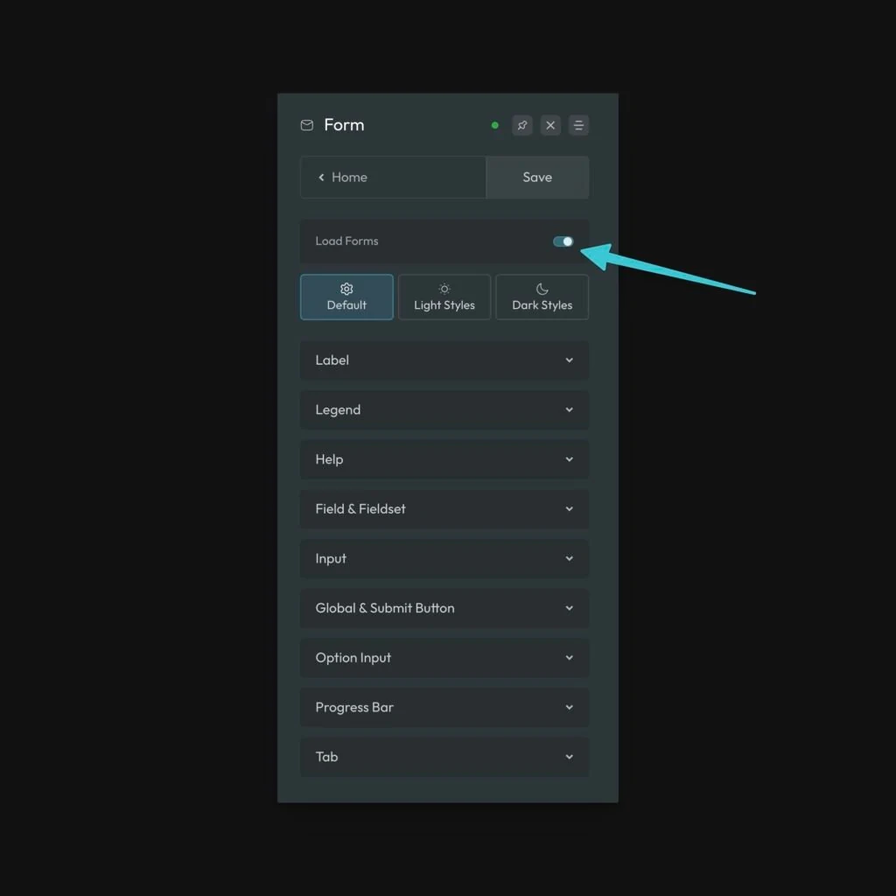

ACSS provides comprehensive form styling for WS Form. To get started, make sure Load Forms is turned on in the Forms screen of the ACSS dashboard:

Load Forms Setting

Once activated, all form styling is automatically applied using a unified configuration system.

## The Premise of Form Styling

Most projects maintain consistent form styles throughout their site. In ACSS, all forms share the same structural and spacing values defined in a single configuration.

Beyond spacing, you have complete control over form colors and appearance. Forms automatically adapt to your site's color scheme—when you switch between light and dark modes, forms intelligently adjust their colors without requiring separate style definitions. This is achieved through CSS's native `light-dark()` function, which respects your site's `color-scheme` setting.

## Automatic Color Adaptation

Forms automatically adapt based on your site's configured `color-scheme` setting. When you switch between light and dark modes, forms intelligently adjust their colors through CSS's native `light-dark()` function, without requiring separate style definitions or manual configuration.

## Styling Forms (Optional Utility Classes)

While forms are styled automatically, ACSS provides optional utility classes for more explicit control if needed. Your options are `.form--light` and `.form--dark`.

These classes can be placed on the form element (or a parent container) in the builder to explicitly set a light or dark appearance, overriding the automatic color-scheme detection. In most cases, however, relying on automatic adaptation is recommended for a seamless experience.

Simply apply `.form--light` or `.form--dark` directly to your form element, and the styles will adapt accordingly. You can then fine-tune your styles further using live preview in the ACSS dashboard.

## Supported Forms

ACSS form styling is currently compatible with **WS Form**. 

## Important Note about WS Form

**The Styler must be enabled** for ACSS form styling to function properly, as our framework relies on WS Form's CSS variables exposed by the Styler.

If you encounter styling issues, ensure you've saved your settings by clicking **Save** in the WS Form settings page to regenerate any necessary system files.
