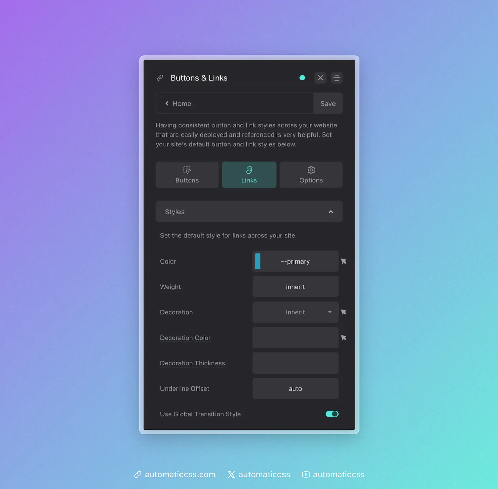
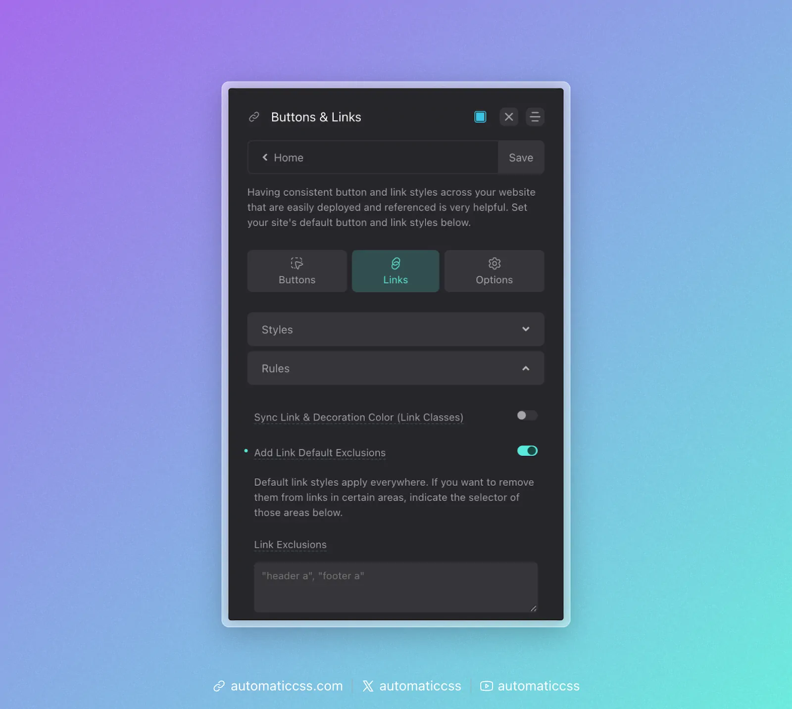

Aside from button styling, setting default link styling for your site is important. Navigate to **Buttons & Links > Links** to configure your global link styles.

## Global Link Styling



This panel controls the default styling of all text links across your site. The following options are available:

- **Color:** Set the default color for all links. Use a color variable like `--primary` for consistency.
- **Weight:** Set the font weight for links. Use `inherit` to match surrounding text.
- **Decoration:** Choose the text decoration style (underline, none, etc.).
- **Decoration Color:** Set a specific color for the underline/decoration.
- **Decoration Thickness:** Control the thickness of the underline.
- **Underline Offset:** Adjust the vertical spacing between text and underline.
- **Use Global Transition Style:** When enabled, links will use your site's global transition settings for hover effects.

## Link Style Exclusions



Since default link styling is broad, you often want to exclude areas from receiving the default link styles. Headers and footers are common areas where you may not want default styles influencing your links.

If you need to exclude certain areas of your site from receiving default link styling, turn on the "Add Link Default Exclusions" feature in the dashboard.

When this feature is on, a `textarea` will appear, allowing you to define rules for the exclusion.

An example would be `"header a"`, which will exclude all links in your header. You can also do `"footer a"` to exclude all links in your footer.

This input accepts multiple rules as long as you separate them by comma:

```
"header a", "footer a", ".nav a"
```

**Note:** Wrap each selector in quotes to ensure that everything is parsed properly and applied to the `:not()` selector correctly.

## Changes From 3.x

In ACSS 4.0:

- Link color utility classes (`.link--primary`, `.link--secondary`, etc.) have been removed to reduce stylesheet bloat. Use CSS custom properties or custom classes instead.
