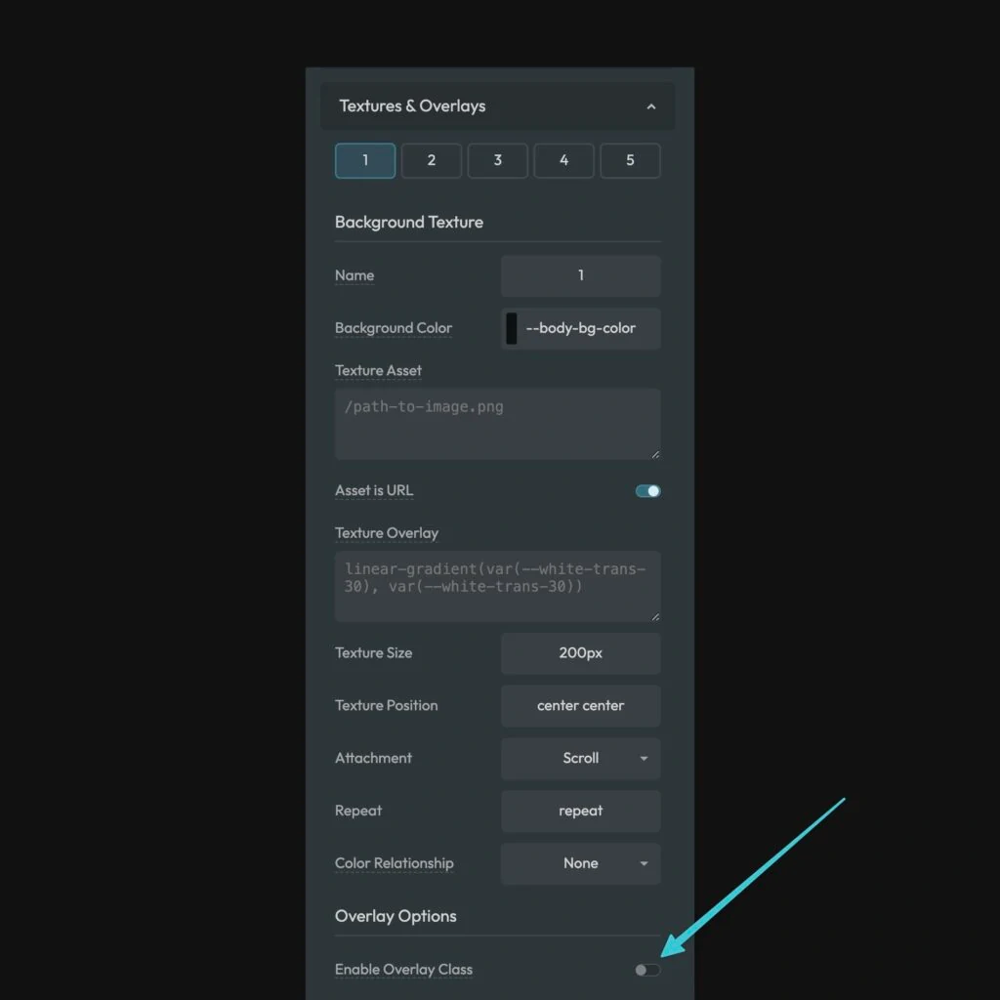

**Note:** Functions and mixins are designed for use in the Custom SCSS area of the Automatic.css dashboard. They will not work in the builder inputs or builder CSS.

Your custom [Textures & Overlays](https://automaticcss.com/docs/textures-overlays/) are available as mixins, which makes it easy to assign them to BEM classes or global areas like the body tag.

## Texture Mixin

To apply your texture as a texture, use the `texture($number)` mixin. **As of right now, the mixins are only compatible with the numbered textures.** Even if you gave your texture a custom name, it can be referenced by its number without issue.

```CSS
body {
    @include texture(1);
}
```

Texture 1 will now be applied to the body tag of your site.

## Texture-Overlay Mixin



To apply your texture as an overlay, ensure that the “Enable Overlay Class” option is on and then use the `texture-overlay($number)` mixin.

```CSS
body {
    @include texture-overlay(1);
}
```

Your texture will now be applied to the body tag as an overlay using a pseudo element.
