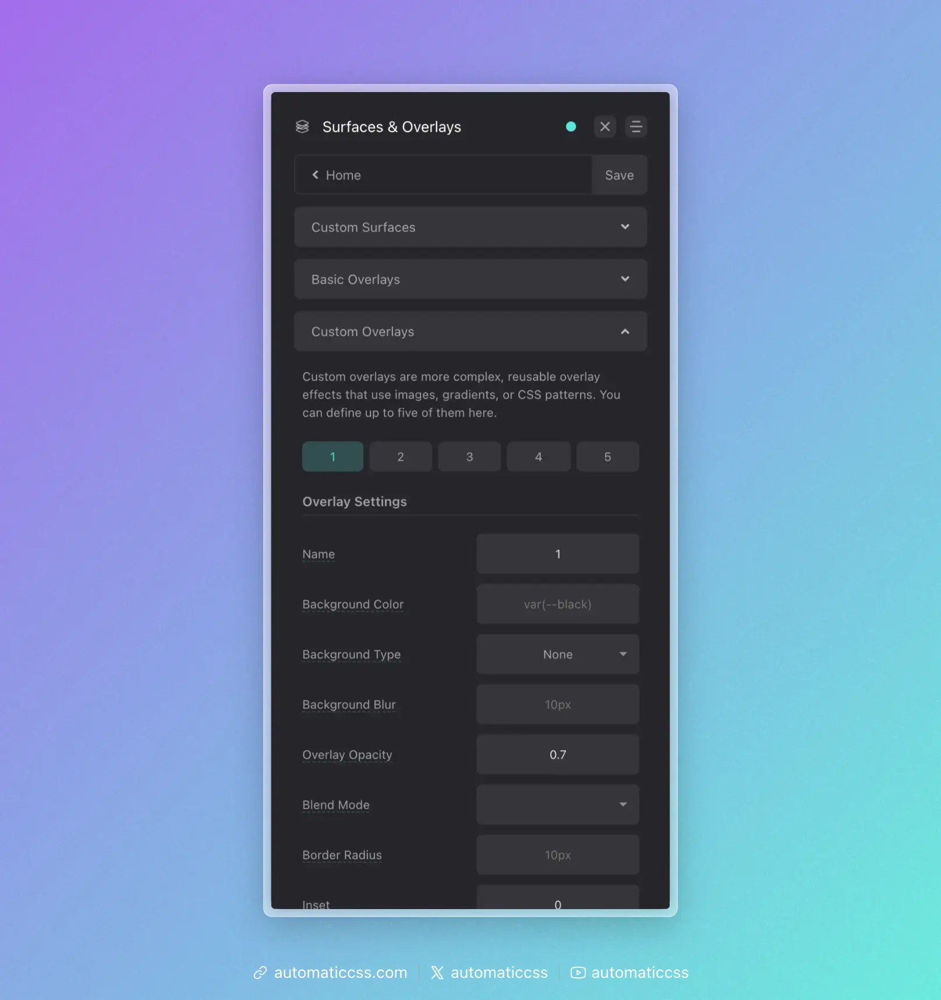

Custom overlays allow you to create reusable, highly configurable overlay effects that can include gradients, images, blur effects, blend modes, animations, and more. Configure up to 5 custom overlays in the ACSS dashboard under **Surfaces & Overlays > Custom Overlays**.



## Creating a Custom Overlay

In the dashboard, each custom overlay has the following options:

| Option | Description |
|--------|-------------|
| **Name** | Optional custom name (creates `.overlay-[name]` class) |
| **Background Color** | Solid color for the overlay |
| **Background Type** | Choose between gradient, image, or none |
| **Background/Asset** | The gradient or image URL |
| **Background Size** | Size of the background (e.g., `cover`, `contain`, `200px`) |
| **Background Position** | Position of the background (e.g., `center center`) |
| **Background Attachment** | Scroll behavior (`scroll`, `fixed`, `local`) |
| **Background Repeat** | Repeat behavior (`repeat`, `no-repeat`, etc.) |
| **Backdrop Blur** | Blur amount for the backdrop filter |
| **Blend Mode** | Mix blend mode for the overlay |
| **Opacity** | Opacity of the overlay (default: 0.7) |
| **Border Radius** | Border radius for rounded overlays |
| **Animation** | CSS animation to apply |
| **Inset** | Custom inset values (default: 0) |

## Using Custom Overlay Classes

Each configured overlay generates utility classes:

```html
<!-- By number -->
<div class="overlay-1">
  <h2>Content above overlay</h2>
</div>

<!-- By custom name (if configured) -->
<div class="overlay-gradient">
  <h2>Content above overlay</h2>
</div>
```

Both the numbered class (`.overlay-1`) and named class (`.overlay-gradient`) will work if you've set a custom name.

## Locally Scoped Variables

Custom overlays expose CSS custom properties that you can override at runtime. Each property has a global override and a per-overlay fallback:

```css
.my-section .overlay-1 {
  /* Global override (affects all overlays on this element) */
  --overlay-opacity: 0.5;
  
  /* Or use the specific overlay variable */
  --overlay-1-opacity: 0.5;
}
```

### Available Variables

| Variable | Per-Overlay Variable | Description |
|----------|---------------------|-------------|
| `--overlay-bg-color` | `--overlay-[n]-bg-color` | Background color |
| `--overlay-background` | `--overlay-[n]-background` | Background gradient |
| `--overlay-background-size` | `--overlay-[n]-background-size` | Background size |
| `--overlay-background-position` | `--overlay-[n]-background-position` | Background position |
| `--overlay-background-repeat` | `--overlay-[n]-background-repeat` | Background repeat |
| `--overlay-background-attachment` | `--overlay-[n]-background-attachment` | Background attachment |
| `--overlay-background-blur` | `--overlay-[n]-background-blur` | Backdrop blur |
| `--overlay-opacity` | `--overlay-[n]-opacity` | Opacity |
| `--overlay-blend-mode` | `--overlay-[n]-blend-mode` | Mix blend mode |
| `--overlay-border-radius` | `--overlay-[n]-border-radius` | Border radius |
| `--overlay-animation` | `--overlay-[n]-animation` | Animation |
| `--overlay-inset` | `--overlay-[n]-inset` | Inset positioning |
| `--overlay-z-index` | `--overlay-[n]-z-index` | Z-index (default: -1) |

## Example: Gradient Overlay

Configure in the dashboard:
- **Name**: `dark-gradient`
- **Background Type**: Gradient
- **Background**: `linear-gradient(to bottom, transparent 0%, rgba(0,0,0,0.8) 100%)`
- **Opacity**: 1

Use in your HTML:

```html
<div class="overlay-dark-gradient">
  
  <div class="hero__content">
    <h1>Title appears above gradient</h1>
  </div>
</div>
```

## Example: Blur Overlay

Configure in the dashboard:
- **Name**: `blur`
- **Background Color**: `rgba(255, 255, 255, 0.1)`
- **Backdrop Blur**: `10px`
- **Opacity**: 1

This creates a frosted glass effect.

## Example: Dynamic Opacity on Hover

```css
.card {
  --overlay-opacity: 0.7;
  transition: --overlay-opacity 0.3s ease;
}

.card:hover {
  --overlay-opacity: 0.3;
}
```

## Technical Details

Custom overlays use a pseudo-element (configurable to `::before` or `::after`) with:
- `position: absolute` with `inset` for full coverage
- `z-index: -1` to appear behind content
- Parent receives `position: relative` and `isolation: isolate`

## Changes From 3.x

In ACSS 4.0:

- Added **backdrop blur** support for frosted glass effects
- Added **animation** support for animated overlays
- Added **nested overlay** support via `border-image`
- Added **custom inset** for partial overlays
- All properties now use CSS custom properties for runtime customization
