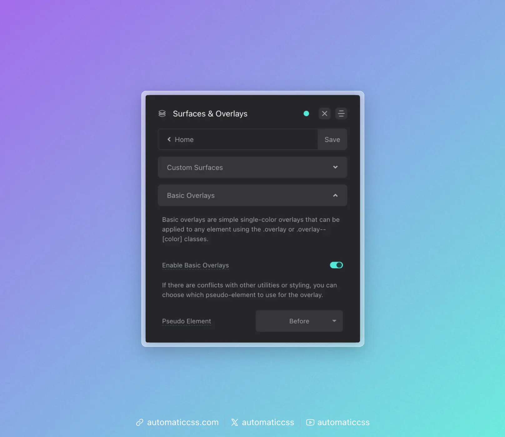

Basic overlays provide a simple way to add a single-color overlay to any element. This is commonly used to improve text readability over background images.

## Enabling Basic Overlays

Enable basic overlays in the ACSS dashboard under **Surfaces & Overlays > Basic Overlays**.



## Pseudo Element Selection

If there are conflicts with other utilities or styling, you can choose which pseudo-element to use for the overlay:

- **Before** (default) - Uses `::before`
- **After** - Uses `::after`

This is configured in the dashboard under the "Pseudo Element" dropdown.

## Usage

Add the `.overlay` class to any element:

```html
<div class="overlay">
  
  <h2>Text appears above the overlay</h2>
</div>
```

You can also use any class containing `overlay--` followed by a descriptor:

```html
<div class="overlay--dark">
  <!-- Content -->
</div>
```

## Customizing the Overlay Color

The overlay color is controlled via the `--overlay-color` CSS variable:

```css
.my-hero {
  --overlay-color: rgba(0, 0, 0, 0.5);
}

.my-light-section {
  --overlay-color: rgba(255, 255, 255, 0.3);
}
```

The default is `rgba(0, 0, 0, 0.7)` (70% black).

## Customizing the Z-Index

The overlay z-index can be customized via the `--overlay-z-index` variable:

```css
.my-element {
  --overlay-z-index: 1;
}
```

The default is `-1`, placing the overlay behind content.

## Figure Element Handling

When using overlays on `<figure>` elements containing media (`img`, `picture`, `svg`, `video`, or `iframe`), the overlay automatically receives `--overlay-z-index: 0` to ensure it appears above the media content.

```html
<figure class="overlay">
  
  <figcaption>Caption appears above the overlay</figcaption>
</figure>
```

## How It Works

Basic overlays use a pseudo-element with isolation to create a proper stacking context:

```css
.overlay {
  position: relative;
  z-index: 0;
  isolation: isolate;
}

.overlay::before {
  content: "";
  background: var(--overlay-color, rgba(0, 0, 0, 0.7));
  position: absolute;
  inset: 0;
  z-index: var(--overlay-z-index, -1);
}
```

The `isolation: isolate` property creates a new stacking context, ensuring proper layering of the overlay and content.

## For More Advanced Overlays

If you need gradients, images, blur effects, blend modes, or animations, see [Custom Overlays](./custom-overlays.md).

## Changes From 3.x

In ACSS 4.0:

- Basic overlays are now a separate toggle from custom overlays.
- Added `isolation: isolate` for better stacking context control.
- Added `--overlay-z-index` variable for customizable z-index.
- Added automatic z-index adjustment for `figure` elements with media.
- The overlay pseudo-element is configurable (`::before` or `::after`) in the dashboard.
