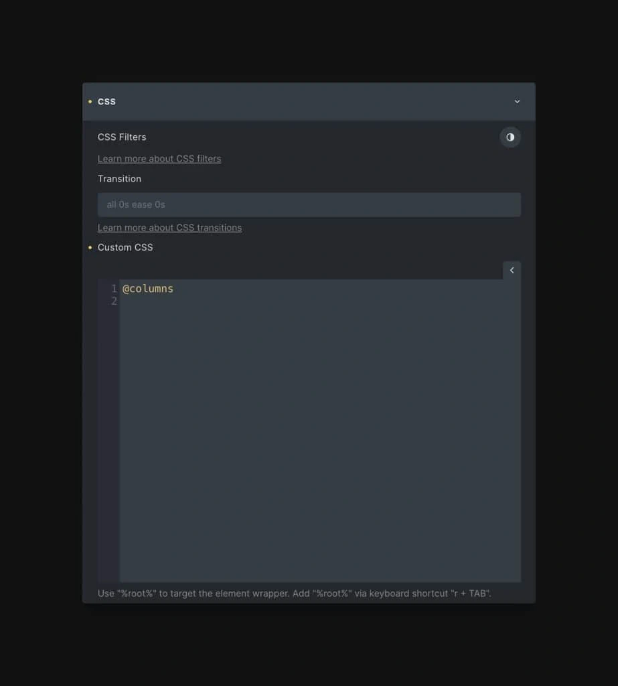

Recipes are a new feature in ACSS v3.0. They’re a very powerful new part of our [variable expansion and validation system](https://automaticcss.com/docs/variable-expansion-validation/).

## What’s a Recipe?

A Recipe is a block of CSS that you can use wherever needed. It works similar to how a [SCSS mixin](https://automaticcss.com/docs/what-are-mixins/) works, but instead of just referencing the block of CSS, the Recipe functionality fully exposes the underlying code.

For example, let’s say you want to turn a big block of paragraphs into a multi-column layout. In ACSS, you could do this with our [Columns utilities](https://automaticcss.com/docs/css-columns/). The downside is that you need to use utility classes, which aren’t always appropriate.

Columns functionality is not something that can be mapped to a CSS variable, so there was no other option for creating columns without writing the CSS yourself, prior to Recipes.

With Recipes, you simply open the rich text element that houses your paragraphs, create a class if you want to assign the Recipe to a class, and then type “@” plus the name of the recipe:



Calling a Recipe in ACSS

Close the line with “;” just as you normally would and the Recipe will appear instantly:

Expanded version of a Recipe in ACSS

Some recipes are very simple and some are complex. It just depends on the utility that you happen to be expanding.

## Using Recipes in Input Fields

Some Recipes are simply the exposed value of a specific variable and can be used as single values in input fields. For example, you can expose all the partials for a color with the Recipe “`@[color-name]-clr`.”

Let’s say you want to create a custom transparency or use a tweaked version of an existing color within the ACSS system. Prior to 3.0, you’d have to write your own HSL string manually using [color partials](https://automaticcss.com/docs/palette-setup/):

```CSS
hsl(var(--action-h) var(--action-s) var(--action-l) / 1)
```

But, with ACSS Recipes, all you have to type is “`@action-clr.`“

Once you type `@action-clr` and hit Enter, the Recipe instantly expands into the full HSL string. Now you can simply change the transparency value, any of the H, S, or L values, or even calc part of the HSL.

Since the HSL uses variable partials, whatever part of the string you don’t edit remains fully hooked into the ACSS system for maximum maintainability.

## Recipes & Stylesheet Efficiency

For users who want to turn off sets of utility classes, Recipes can be a great way to continue accessing the functionality of those utilities on a case-by-case basis.

Using our example above, you could turn off “Columns” classes in ACSS, which removes all the columns utilities from the stylesheet (making your stylesheet lighter). If you need columns on your project, you cans simply use `@columns` to get the functionality wherever its needed without having to load all the columns utilities.

## The future of Recipes

ACSS 3.0 ships with some initial Recipes for popular non-variable-driven utilities ([columns](https://automaticcss.com/docs/css-columns/), [masonry](https://automaticcss.com/docs/masonry-layouts/), [clickable parent](https://automaticcss.com/docs/clickable-parent/), [focus parent](https://automaticcss.com/docs/focus-parent/), [flex-grid](https://automaticcss.com/docs/flex-grids-flexbox-grids/), color expansion, and more). We’ll quickly expand Recipes functionality to all utilities that will provide great value to the user.

In addition to pre-configured Recipes provided by the framework, we have plans to allow for custom Recipes and Recipe-sharing. You’ll be able to write and save your own Recipes and import/export those recipes between sites. You can also share Recipes or groups of Recipes with other users (in the future).

Recipes introduce a big leap forward in workflow efficiency that we’re proud to bring to the ACSS ecosystem.
