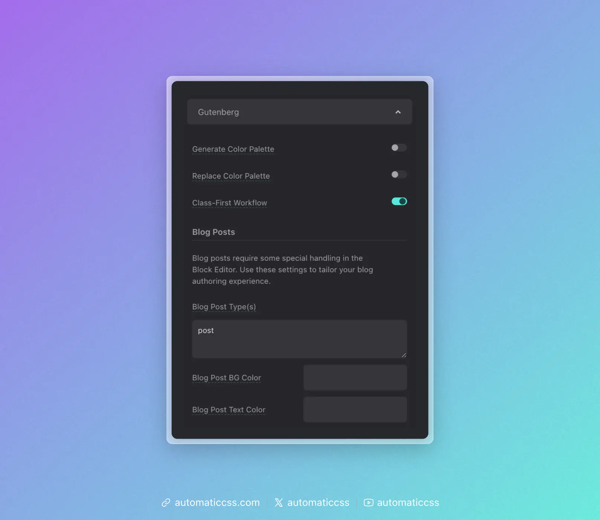

Automatic.css is fully compatible with WordPress' Gutenberg editor. Open the ACSS dashboard and navigate to **Options > Gutenberg** to configure.



## Available Options

### Generate Color Palette

When enabled, ACSS colors, shades, and transparencies will be available in the Gutenberg editor color palette along with any other colors generated elsewhere.

### Replace Color Palette

When enabled, the ACSS color system will fully replace all existing site color options.

### Class-First Workflow

When enabled, ACSS will move the Gutenberg classes input to the top of the block editing panel for faster, easier access.

## Blog Posts

Blog posts require some special handling in the Block Editor. Use these settings to tailor your blog authoring experience.

### Blog Post Type(s)

Specify which post types should use the blog post styling. The default is `post`. Add additional post type slugs separated by commas if needed.

### Blog Post BG Color

Set a custom background color for the blog post editor.

### Blog Post Text Color

Set a custom text color for the blog post editor.

## Adding Support for Custom Post Types

To add ACSS support for custom post types, add the below snippet to your functions.php file:

```php
add_filter(
    'acss/gutenberg/allowed_post_types',
    function( $post_types ) {
        return array_merge( $post_types, array( 'post-type-slug', 'another-slug' ) );
    }
);
```

Replace `'post-type-slug'` with the slugs of the custom post types you want to enable.

## Changes From 3.x

In ACSS 4.0:

- Simplified Gutenberg options panel.
- Added Blog Post BG Color and Blog Post Text Color settings.
- Removed "Load Styles in Block Editor" and "Use Block Editor for Page Building" toggles (now automatic).
