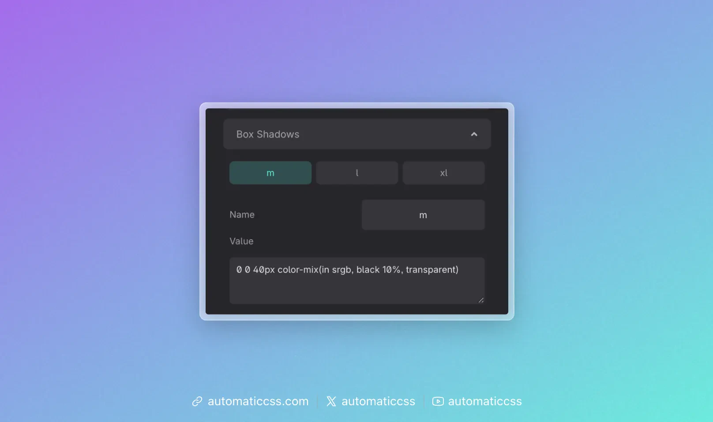

ACSS provides three customizable box shadow variables that can be configured in the dashboard under **Additional Styling > Box Shadows**.



## Available Variables

By default, the box shadow variables are:

- `var(--box-shadow-m)` - Medium shadow
- `var(--box-shadow-l)` - Large shadow
- `var(--box-shadow-xl)` - Extra large shadow

Numeric versions are also available:

- `var(--box-shadow-1)`
- `var(--box-shadow-2)`
- `var(--box-shadow-3)`

## Using Box Shadows

Apply box shadows using the CSS variables:

```css
.my-card {
  box-shadow: var(--box-shadow-m);
}

.my-modal {
  box-shadow: var(--box-shadow-xl);
}
```

## Customizing Box Shadows

In the dashboard under **Additional Styling > Box Shadows**, you can customize:

### Name

Each shadow can have a custom name. For example, if you name a shadow "primary", the variable becomes `var(--box-shadow-primary)`.

The numeric variable (`--box-shadow-1`, etc.) remains available regardless of the custom name.

### Value

Enter any valid CSS box-shadow value, including compound shadows. Omit the semicolon.

Example values:

```css
/* Simple shadow */
0 4px 20px rgba(0, 0, 0, 0.1)

/* Compound shadow for depth */
0 4px 4px -10px hsl(0 0% 0% / 0.04),
0 13px 13px -10px hsl(0 0% 0% / 0.06),
0 40px 60px -10px hsl(0 0% 0% / 0.08)
```

Use a [box shadow generator](https://box-shadow.dev/) if you need help creating shadow values.

## Default Values

The default shadows use `color-mix()` for clean, neutral shadows:

| Variable | Default Value |
|----------|---------------|
| `--box-shadow-m` | `0 0 40px color-mix(in srgb, black 10%, transparent)` |
| `--box-shadow-l` | `0 0 60px color-mix(in srgb, black 20%, transparent)` |
| `--box-shadow-xl` | `0 0 80px color-mix(in srgb, black 30%, transparent)` |

## Changes From 3.x

In ACSS 4.0:

- Box shadow **utility classes** (`.box-shadow--m`, etc.) have been **removed**. Use the CSS variables instead.
- Default values now use `color-mix()` for cleaner shadow colors.
- Numeric variable aliases (`--box-shadow-1`, `--box-shadow-2`, `--box-shadow-3`) are always available alongside named versions.
