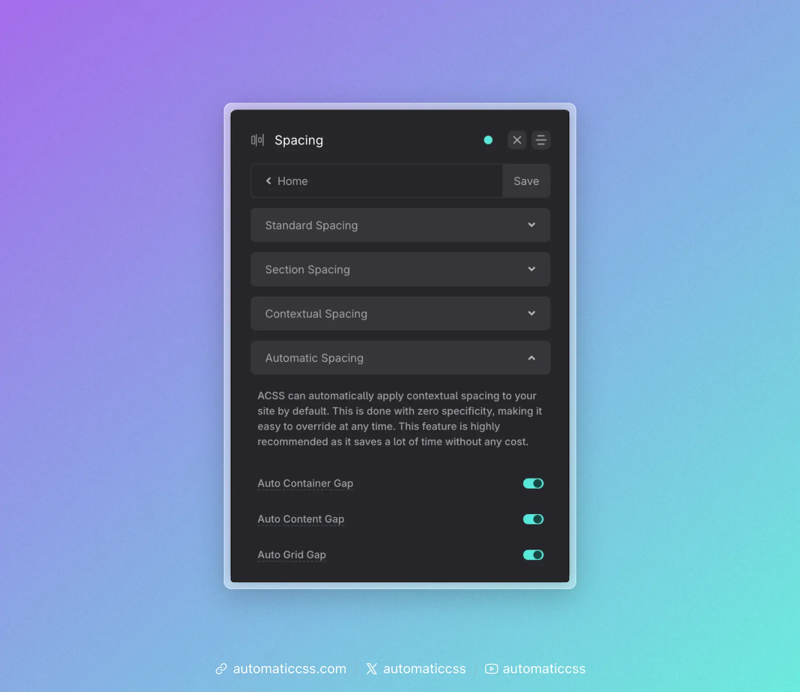

ACSS can automatically apply contextual spacing to your site by default. This is done with zero specificity, making it easy to override at any time. This feature is highly recommended as it saves a lot of time without any cost.

## How It Works

You don't have to manually use contextual utilities within sections, containers, and grids. Simply activate Automatic Spacing and ACSS will apply the spacing for you automatically.

When enabled, ACSS applies the following:

- **Auto Container Gap**: Targets all `section` elements and applies container-gap spacing between divs that are direct children of the `section` element.
- **Auto Content Gap**: Targets all divs/containers that are direct children of `section` elements and applies content-gap spacing. Also targets all div/block elements in general and applies content-gap spacing.
- **Auto Grid Gap**: Targets all grids that use [grid utility classes](../grids/grid-classes-standard.md) and applies grid-gap.

## Zero Specificity

To avoid conflicts and make it easy to override automatic spacing, ACSS applies these spacing values with zero specificity. The automatic spacing can be overridden at any point with:

- Other utility classes
- Custom classes
- ID styling
- Inline styling
- Global styling with any specificity value

## When to Use

Automatic Spacing is ideal for:

- New projects where you want consistent spacing out of the box
- Sites that follow standard section/container/content structure
- Reducing the need to manually apply gap utilities everywhere

You can selectively enable or disable each type of automatic spacing (container, content, grid) based on your needs.
