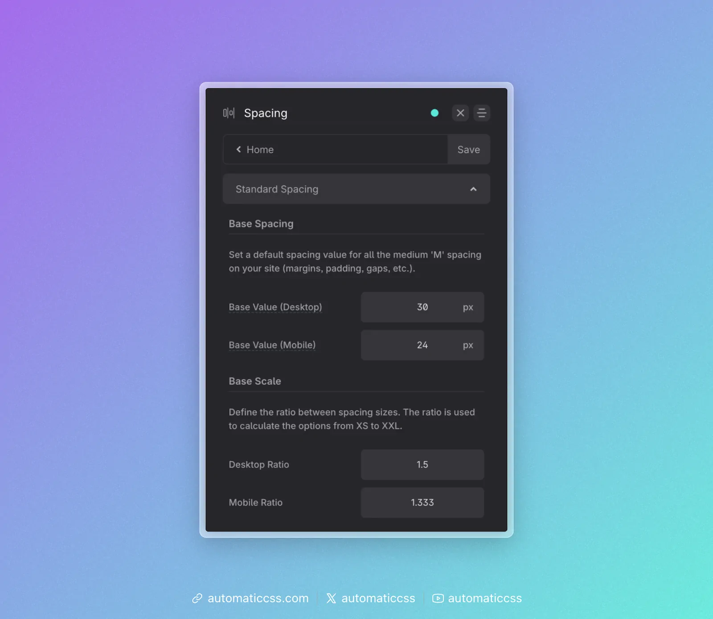

ACSS provides fluid responsive, scale-based spacing out of the box and all the spacing is user-adjustable.

To get started, navigate to the Spacing area of the dashboard:

## Standard Spacing Values

Standard Spacing asks for a **Base Spacing** value and a **Base Scale** value.

**Base Spacing** is the spacing value that controls all spacing across the website. It’s directly mapped to all “M” (medium) spacing values and affects section spacing values as well.

The Base Value (Desktop) will be the exact value of your base spacing at [content width](../dimension/content-width.md) and beyond, the mobile value will be the exact value at your website’s minimum width, and the degree of difference between these values will control how aggressively spacing scales from desktop to mobile.

**Base Scale** is the math scale used to generate additional sizes above and below “M.” Sizes above “M” are multiplied by the scale value and sizes below “M” are divided by the scale value.

The Desktop Ratio controls how much variance there is between sizes near content-width and the Mobile Ratio controls the degree of variance between sizes toward the minimum website width. This allows you to scale spacing sizes more aggressively on desktop and more conservatively on mobile.

**Tip:** If you want to make _all_ spacing bigger or smaller, adjust the base value. If you only want to change the degree of spacing between different spacing sizes, adjust the scale. If you want to tweak both, tweak both.

## What Standard Spacing Affects

Standard spacing affects the following:

- [Spacing Variables](spacing-variables.md)
- [Section Padding Classes](section-padding-classes.md)
- [Contextual Spacing Utilities](contextual-spacing.md)
- [Header Classes](header-padding-classes.md)

You can adjust standard spacing at any time, even after a website is completely built.
