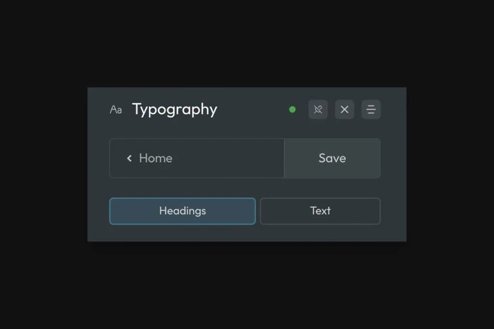

Automatic.css allow you to set key default styles related to the headings and text.

First, navigate to the Typography panel in the dashboard and then choose the tab to edit either heading or text defaults:

Typography Tabs in ACSS

## Heading & Text Defaults

The options for setting defaults are roughly the same for headings and text:

ACSS Heading Defaults

- **Root Font Size**: Set your site’s default [root font size](https://youtu.be/cwfxZRLqyus?si=pLCacUEu_egkwj7M).
- **Base Heading Size**: Set a min and max for [fluid responsive base (H4) heading](fluid-headings.md) or [text (M) size](fluid-text.md).
- **Type Scale**: Set a mobile/desktop scale value for generating additional sizes.
- **Font Family:** Set a [Font-Family](https://developer.mozilla.org/en-US/docs/Web/CSS/font-family) for heading and text.
- **All: Heading Color**: Set a default color for all headings or text sizes.
- **All: Line Height**: Set [line-height](https://developer.mozilla.org/en-US/docs/Web/CSS/line-height) for all headings or text sizes.\*
- **All: Font Weight**: Set default [font-weight](https://developer.mozilla.org/en-US/docs/Web/CSS/font-weight) for all headings or text sizes.
- **All: Letter Spacing**: Set default [letter-spacing](https://developer.mozilla.org/en-US/docs/Web/CSS/letter-spacing) for all headings or text sizes.
- **All: Max-Width**: Set default max-width for all headings or text sizes.\*\*
- **All: Font Style**: Set default [font-style](https://developer.mozilla.org/en-US/docs/Web/CSS/font-style) for all headings or text sizes.
- **All: Text Transform**: Set default [text-transform](https://developer.mozilla.org/en-US/docs/Web/CSS/text-transform) for all headings or text sizes.
- **All: Text Wrap**: Set default [text-wrap](https://developer.mozilla.org/en-US/docs/Web/CSS/text-wrap) for all headings or text sizes.\*\*\*

### \* Default line-height (Smart Line Height)

ACSS uses what we call “Smart Line Height” as a default value for all headings and text. Rather than using standard values like “1.1” or “1.5,” Smart Line Height uses a formula based on a desired leading value which is then added to double the x-height of the typeface.

Smart Line Height scales more accurately across various typefaces and font-sizes and is especially awesome for fluid responsive typography. It’s also more efficient, since you don’t have to set a value for every heading and text size – it looks good across the board automatically.

If you want to adjust this line-height value, we recommend changing the `ex` value inside the `calc()` function in decimal increments. Of course, you can use whatever value you want, but Smart Line Height is pretty awesome.

### \*\* Default max-width

Setting a max on the width of lines is [important for maintaining proper readability on a website](text-heading-line-length.md). Unfortunately, due to Bricks’ application of max-width defaults, there’s no way for us to apply max-widths on headings and text without breakage. Therefore, this option is not applied in Bricks.

### \*\*\* Default text-wrap

The default value of “pretty” automatically prevents typography orphans on your website. The other option is “balance” which balances headings, but doesn’t work on text that’s more than 4 lines. Balance is a little heavy-handed, which is why the default is “pretty.” If you want to turn this feature off, set the value to “wrap.”

## Setting Defaults for Individual Heading & Text Sizes

Every heading and text level has a defaults panel so you can set defaults granularly. Simply choose the heading or text level that you want to adjust from the tab options:

Heading tabs

Text tabs
