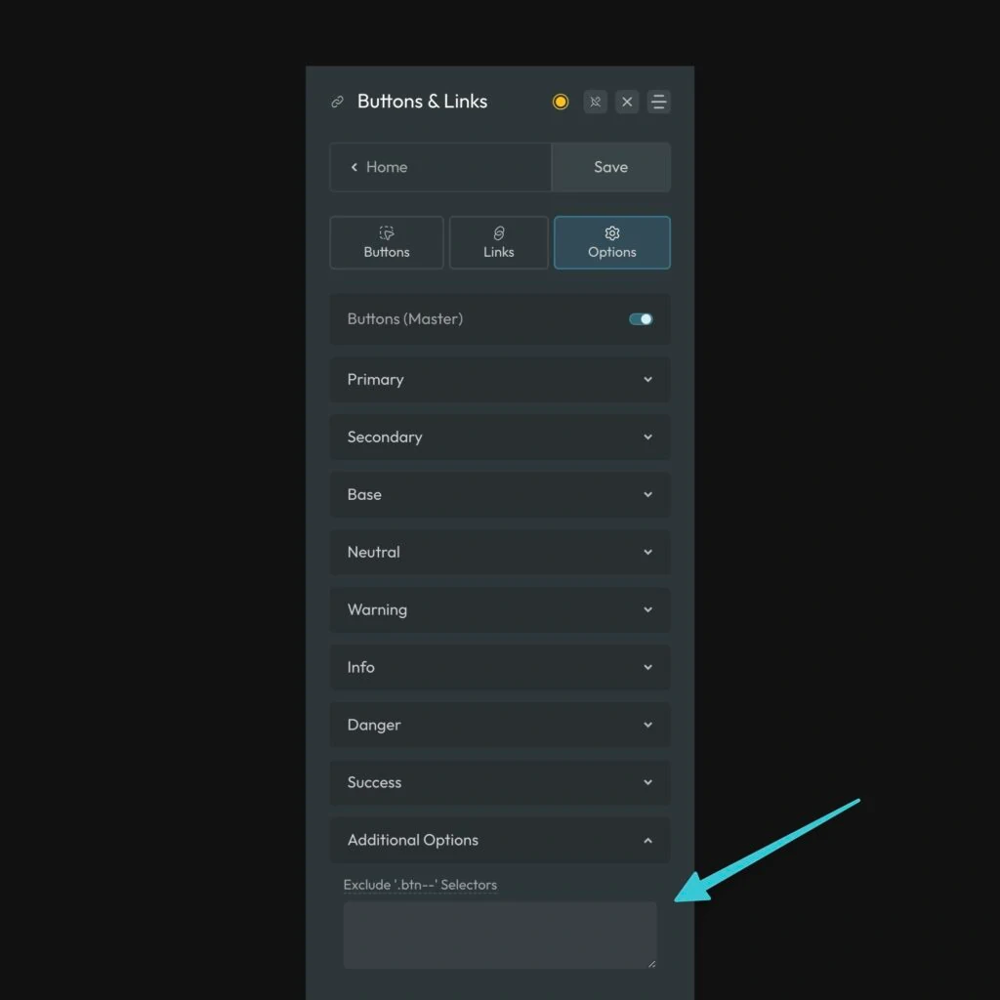

ACSS automatically applies all _default_ button styles and the button framework to any class that starts with `.btn--`. This makes it easy for you to create custom buttons while maintaining shared defaults and it also applies defaults to third party buttons.

In some cases, however, third party tools may use the same `.btn--` syntax, causing styles to be applied automatically even when they aren’t desirable. ACSS provides a pathway for excluding any selectors from receiving button styles. Just navigate to **Buttons & Links > Options > Additional Options**:



List any selectors here, separated by a comma. For example, if `.btn--third-party-example` is getting styling and you don’t want it to, add it to the input field as `.btn--third-party-example`. If you need to do more than one, it would look like this:

```CSS
.btn--third-party-example, .btn--another, .btn--yet-another
```

Once a selector is listed here, you’ll notice that ACSS completely ignores it and does not apply any button styling whatsoever.
