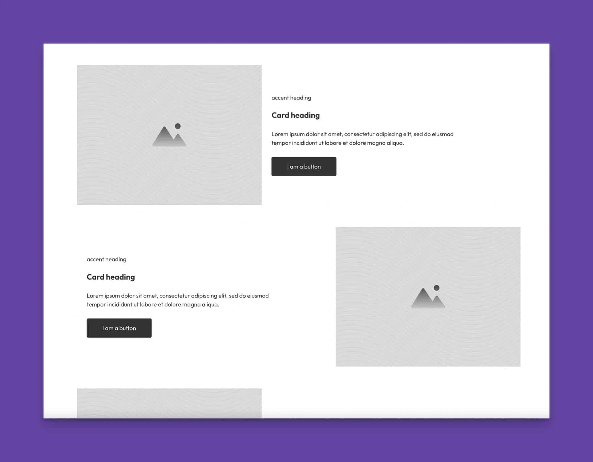

ACSS is one of the only frameworks to offer utilities for **automatically alternating, two-column grids.** This is a typical layout technique on the modern web where text is placed in a column next to an image or other media, and then in the next row, the two items switch positions. This pattern repeats back and forth.

Alternating Grid Example

## How to create an auto-alternating grid

1.  Create a container for all your two-column grid “rows.”
2.  Create your two-column layout using `.grid--` classes. You can use even grid like `.grid--2` or any of the uneven grid classes, such as `.grid--2-3`.
3.  Duplicate the “row” as many times as needed.
4.  Decide which breakpoint (and up) you want the grids to start alternating at (you typically don’t want them alternating their content on mobile devices.
5.  Add a `.grid-alternate--` class that matches the smallest breakpoint you want them to start alternating at. This is a “min-width” media query, so it will affect your grid at the chosen breakpoint and UP (not down). For example, `.grid-alternate--l` will alternate your row content at the L breakpoint and up.
6.  Don’t forget to use the other `.grid--` [media query classes](grid-classes-standard.md) to make your grid responsive.
