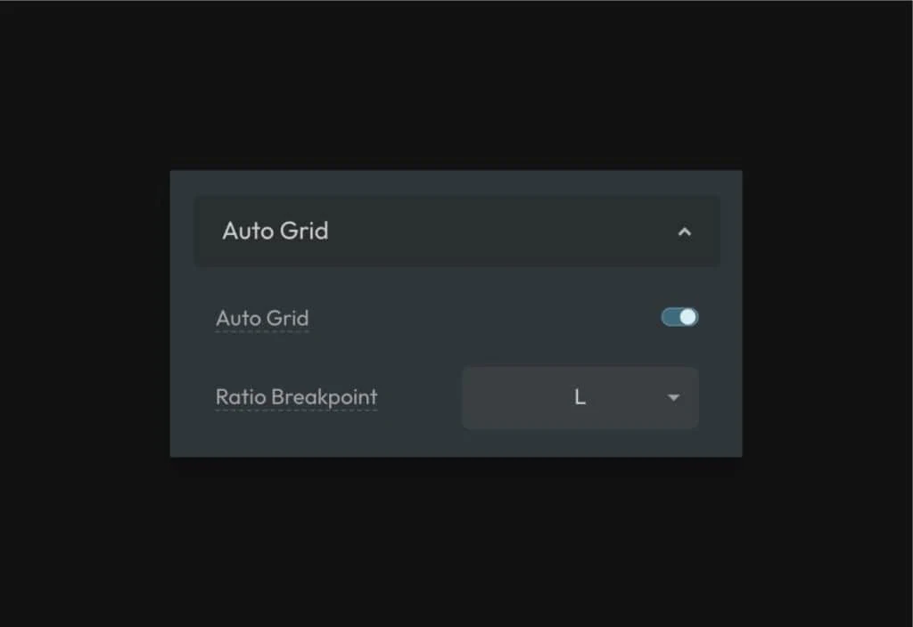
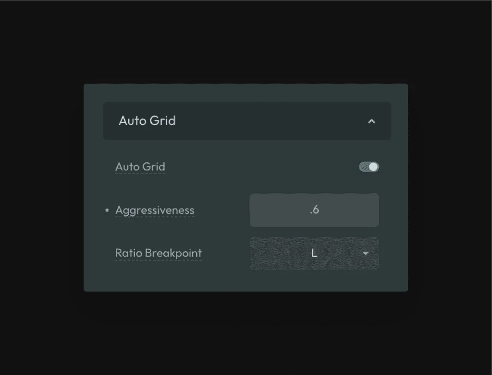

Auto Grids are automatically responsive grids that don’t require the user to make any breakpoint decisions.

Here are some **benefits** of Auto Grids in ACSS:

- Lightweight CSS
- No breakpoint decisions
- Can be reactive to the specific type of content in the grid by adjusting var(–min)
- Can be applied to a custom class with a mixin: @include auto-grid($col-count, $min-item-width);
- Can be applied to a custom class with a recipe: @auto-grid;

**Downsides** of Auto Grids:

- Using column and row spans isn’t practical.

Remember, none of the grid systems in ACSS are perfect for every scenario. We give you multiple different types of grid systems so you can choose the most appropriate system for each situation.

## Turning on Auto Grids

Auto Grid can be turned on in the options panel under Utility Classes. Once activated, you’ll see an Auto Grid area in the Layout panel:



Screenshot

## How to Apply Auto Grid With Classes

Auto Grid has utility-class support for up to 12 columns as well as support for what we call “ratio grids.”

- `.grid--auto-2`
- `.grid--auto-3`
- `.grid--auto-4`
- `.grid--auto-5`
- `.grid--auto-6`
- `.grid--auto-7`
- `.grid--auto-8`
- `.grid--auto-9`
- `.grid--auto-10`
- `.grid--auto-11`
- `.grid--auto-12`
- `.grid--auto-1-2`
- `.grid--auto-2-1`
- `.grid--auto-2-3`
- `.grid--auto-3-2`
- `.grid--auto-1-3`
- `.grid--auto-3-1`

### Auto-Grid Stacking Aggressiveness

Auto Grid Aggressiveness Setting

By default, Auto Grids use a math formula to figure out when grid items should stack. This math formula has a user-adjustable control that we call “Aggressiveness.”

This setting controls the default aggressiveness of \*all\* Auto Grids across the site. If you want items to have more sizing leeway prior to stacking, use a lower number. If you want items to have less sizing leeway and stack sooner, use a higher number.

The acceptable value is a decimal from 0 to 1.

Remember, this is only the default. You can control the exact stacking behavior of individual Auto Grids using the `--min` control…

### Minimum Item Width

Auto Grids work by setting a minimum item width on the items in the grid. As the device size gets narrower, the Auto Grid responds by moving items to new rows once they reach their minimum allowed width.

You don’t have to set a minimum width value since one is already set for you. But, a great feature of auto grids is that you can control this minimum width value if desired, which means you can make the responsiveness of the grid perfectly match the requirements of the content inside it.

Let’s say you have a testimonial card and you want to put a lot of them in a 3-column grid. Based on the design of the card, it starts looking too squished if its width goes below 280px.

Start by applying `.grid--auto-3` to the parent container of the cards to establish the 3-column Auto Grid. Now, for this particular grid, go to the ID level and add some custom CSS:

```CSS
%root% {
    --min: 280px;
}
```

Now your auto grid will start stacking your testimonial cards as soon as they hit 280px in width. Instead of having to worry about breakpoints, which are disconnected from your content, Auto Grid makes responsiveness content-based.

**Note:** Due to variable encapsulation, this `--min` variable will not be honored if you apply the grid with a variable (see below).

## How to Apply Auto Grid With Variables

Auto grids (1-12) can be applied with variables as well. This lets you use Auto Grid with custom BEM classes.

Set a box to display grid and then use one of the Auto Grid variables in the grid-template-columns property:

```CSS
.your-selector {
    display: grid;
    grid-template-columns: var(--grid-auto-4);
}
```

**Note:** Due to variable encapsulation, this is the most limited way to use auto grids. You should only use this method if you’re okay with the default stacking behavior of the Auto Grid. If more control is needed, use the [auto grid mixin](../mixins/auto-grid-mixin.md) or the [auto grid recipe](../recipes/grid-recipes.md).

## How to Apply Auto Grid With a Mixin

If you need to apply Auto Grid to a custom selector, you can easily do this with the [auto grid mixin](../mixins/auto-grid-mixin.md) via the “Custom SCSS” area of the ACSS dashboard.

## How to Apply Auto Grid With a Recipe

[Auto Grid is also compatible with our recipes feature](../recipes/grid-recipes.md). This allows you to apply Auto Grid to a custom class using vanilla CSS.

Select the element you want to turn into an auto grid, add a custom class, and then go to the custom CSS area of the style panel.

You can trigger the Auto Grid recipe by typing `@auto-grid;`

The column count and minimum item width are both editable in the recipe.

## Auto Ratio Grids

Ratio Grids are grids with uneven columns. The following ratios are available for Auto Ratio Grids:

- `.grid--auto-1-2`
- `.grid--auto-2-1`
- `.grid--auto-2-3`
- `.grid--auto-3-2`
- `.grid--auto-1-3`
- `.grid--auto-3-1`

These are not true Auto Grids in the sense that they don’t use the exact same logic as Auto Grids. They are, however, automatically responsive.

Auto Ratio Grids use a traditional grid structure to create the desired ratio, and then automatically stack at a specific breakpoint. The default stacking breakpoint is the “L” breakpoint, but you can change this if needed in the Layout panel by editing the “Ratio Breakpoint” field.



Screenshot

## Forcing Even Columns and Eliminating Orphans

3.2.10

Users have the option of forcing even columns to eliminate orphans during column stacking.

This will force all auto grids with an even number of initial columns to remain with even columns down to the “Initial Breakpoint (EC)” value set in the same area of the dashboard.

The Initial Breakpoint value is a min-width media query that forces even columns at the chosen breakpoint and up. By default, this is set to the “S” breakpoint, meaning even columns will be forced at all breakpoints above S.

A breakpoint has to be declared here because “1” is an odd number. We have to know where to allow for a single column, otherwise this setting would for all even grids to have a minimum of two columns.

### Even Columns & “Any” Columns with Utility Classes

3.2.10

“Force Even Columns” is a global setting that affects all auto grids. You can still force individual auto grids to have even columns without turning this on by using the `.grid--stack-even` utility class.

The reverse is true as well. If you turn on the global option, but need to disable it on a specific grid, you can use `.grid--stack-any`.

Additionally, you can override the breakpoint these behaviors occur at using breakpoint classes that follow the syntax: `.grid--stack-{type}-{breakpoint}`.

It’s important to note that the “stack-even” classes are mobile-first (min-width) while the “stack-any” are traditional breakpoint classes (max-width). This means “stack-even” affects the chosen breakpoint and up while “stack-any” affects the chosen breakpoint and down.

## Controlling the Column Flow

3.2.10

The technique used for auto grids accepts two CSS keywords: `auto-fit` and `auto-fill`. By default, auto grids use `auto-fit`. This means that if you have less items than the specified initial column count, the items will stretch to fill the available space.

This is useful in many cases, but not all cases. In some cases you may want the items in your grid to be assigned to their actual cell, leaving the empty cells empty and the space reserved for them. If this is the case, you need to set the flow to `auto-fill`.

You can change the flow globally in the dashboard or per grid instance using a utility class.

To set the option globally, choose `auto-fill` in the dashboard:

To set the option manually, use `.grid--auto-fill`. Consequently, if you have chosen `auto-fill` as the global default, you can change any grid back to `auto-fit` with `.grid--auto-fit`.
