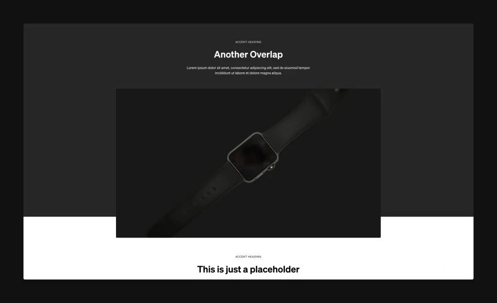

Overlap recipes allow you to quickly create two different types of overlap effects in your design.

## Benefits & Compatibilities

Traditional overlap techniques all have various pros and cons. The technique deployed with the `@overlap` recipe has far more upsides than any other technique and a smaller list of cons.

- Can be applied to classes or IDs.
- Can be manipulated per-instance separately from the class application.
- Supports background color, background image, and background patterns.
- Supports all background attachments, sizes, repeats, etc. including fixed backgrounds.
- Supports an overlay color including gradient overlays.
- Supports masks, clip paths, and custom border radii.
- Supports background styles on the same container.

## `@overlap;`



Overlap

`@overlap` is a simple recipe for adding an overlap effect to any box with some unique benefits. The overlap is effectively a background-type style that extends from the top of the box to a stopping point prior to the bottom of the box. The stopping point is user-editable.

## `@overlap-alt;`

Overlap-alt example

`@overlap-alt` deploys a background to the adjacent sibling box with the overlap extending up into the target box.

## Native Properties for Customization

The following variables / custom properties are available for immediate customization when using the recipe:

- –background: Sets the background using any valid shorthand background value.
- –foreground: Sets the foreground color of the adjacent content group (headings and paragraphs by default).
- –overlap-amount: Sets the amount of overlap.
- –overlay: Sets the overlay color or gradient.

## Background Images and Patterns

Any valid [shorthand background property](https://developer.mozilla.org/en-US/docs/Web/CSS/background) value will work with the `--background` variable. This means you can use images and patterns as your overlap effect. You can also declare an overlay for your background using the `--overlay` property.

```CSS
--background: url(/wp-content/uploads/geometric-leaves.webp) top / 200px repeat;
```

## Customizing the Overlay

By default, the overlay is set to transparent. To create a uniform overlay, replace both instances of “transparent” with the same transparent color:

```CSS
--overlay: linear-gradient(var(--black-trans-10), var(--black-trans-10));
```

To create a gradient overlay, set two different values:

```CSS
--overlay: linear-gradient(var(--primary-trans-30), var(--secondary-trans-30));
```

You can use any valid linear gradient, but maintaining the linear-gradient value is required for the overlay to work.

## Border Radius

You can use border radius on your overlap effect by adding border-radius to the pseudo element.

```CSS
%root% + *::before {
    border-radius: 0 150px 0 0;
}
```

## Masks & Clip Paths

You can create fancier overlap/divider techniques with the use of masks and clip paths.

Clip path divider overlap

In the above example, we’re using a clip path to create an angled divider overlap effect. You can apply masks and clip paths to the pseudo element:

```CSS
%root% + *::before {
    clip-path: polygon(0 10%, 100% 0, 100% 100%, 0% 100%);
}
```

Many other possibilities are available depending on your level of skill, so feel free to play and experiment with this recipe!
