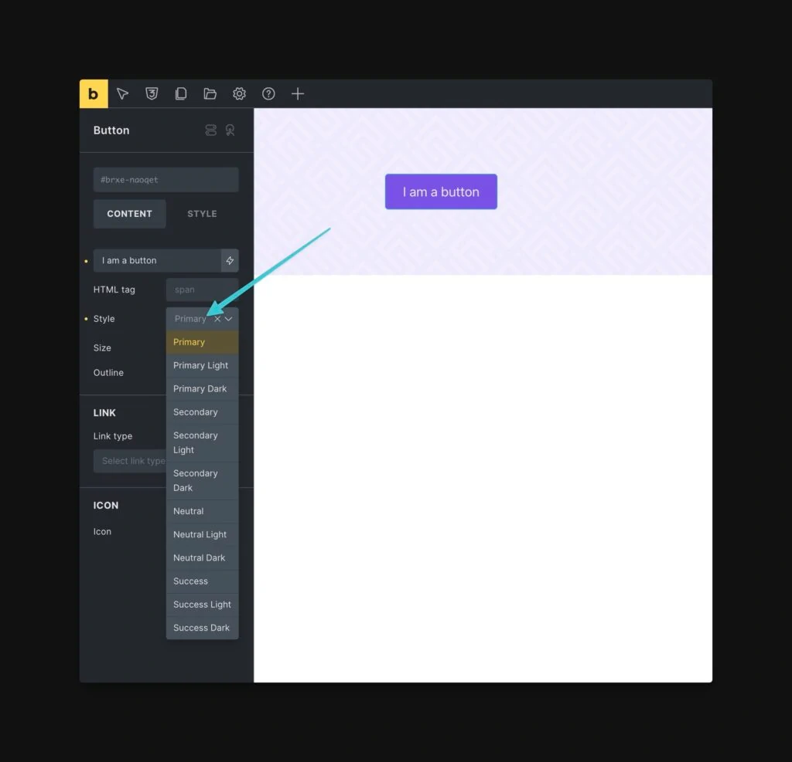

ACSS is compatible with the Bricks Button UI as of version 3.2.8.

Note: This feature is not compatible with deprecated button styles (action, white, black). It’s fully compatible with all current button styles, including light/dark variants).

Bricks Button UI

Users can activate this builder enhancement in ACSS and four things will happen:

1.  Buttons added in Bricks will automatically receive “primary” button styling.
2.  Users can use the Button Style, Button Size, and Outline options in the Bricks UI to change button styles.
3.  The Button Style and Button Size options will populate with ACSS options only.
4.  The Button Style and Button Size options will automatically sync with ACSS’ available button styles so you only see options that are available on that particular install.

## Activating Compatibility

This feature is off by default. To enable it, open the ACSS dashboard and go to Options > Bricks Enhancements > Use Bricks UI for Buttons.

Once you save, you’ll need to refresh any open builder instances before you’ll see the feature working.

## Using the UI

When you add a button, it will automatically adopt the primary style. To change the style, select a different option from the “Style” dropdown. All available options are ACSS options.

Additionally, you can control the size of your buttons with the “Size” dropdown. And if you want the outline variant for any button, you can trigger the “Outline” toggle.

The feature works by simply applying or removing ACSS button classes, so it’s fully compatible with ACSS without any additional code being output.
